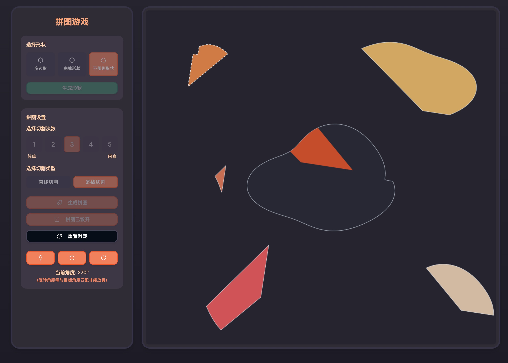

# Generative Puzzle



一个基于Next.js和React的生成式拼图游戏项目，提供丰富的交互式拼图体验。

## 功能特性

- 🎨 多种形状类型：支持多边形、曲线形状和不规则形状生成
- ✂️ 可定制切割：支持1-5次切割和直线/斜线切割类型
- 🧩 精确角度匹配：10度精度的角度匹配系统
- 🖱️ 直观的拖拽和旋转交互
- ✨ 精美视觉特效：包括星星、彩带、动态颜色变化
- 🎯 磁吸效果和位置提示系统
- 🌈 儿童友好的暖色系界面
- 🚀 美观的加载页面：提供进度条和动画拼图碎片
- 📱 优化的屏幕适配：自动调整拼图大小和位置
- 🔄 智能的拼图分布：避免拼图超出画布边界

## 技术栈

- **前端框架**: Next.js 15.1.0
- **UI组件**: Radix UI + Shadcn UI
- **样式**: Tailwind CSS
- **状态管理**: React Context + useReducer
- **类型检查**: TypeScript
- **渲染技术**: HTML Canvas API
- **构建优化**: 并行服务器编译
- **动画效果**: CSS动画 + Canvas绘图

## 运行环境

- **开发服务器**: localhost:3001-3003 (自动端口分配)
- **运行模式**: 开发模式 (npm run dev)
- **构建优化**: 并行服务器编译、WebPack构建优化
- **主要目标平台**: 现代桌面浏览器和移动设备

## 核心模块

### 1. GameContext

游戏的核心状态管理系统，使用React Context API和useReducer实现。

**主要功能**：
- 管理游戏所有状态，包括形状、拼图、拖拽、完成状态等
- 提供状态更新接口，确保数据流单向
- 集中处理游戏逻辑操作，如生成形状、创建拼图、旋转片段等
- 实现位置重置、提示显示等辅助功能
- 管理画布尺寸信息和屏幕适配

### 2. PuzzleCanvas

画布渲染和交互处理的核心组件。

**主要功能**：
- 使用多层画布结构，提高渲染效率
- 实现拖拽、点击检测、碰撞检测等交互功能
- 渲染游戏中所有视觉元素，包括形状、拼图片段、辅助元素
- 处理完成状态的特效动画（星星、彩带）
- 动态响应窗口尺寸变化，重新计算画布大小

### 3. 加载系统

由`LoadingScreen`和`LoadingScreenStatic`组件组成的加载体验优化系统。

**主要功能**：
- 显示"Generative Puzzle"游戏标题和品牌标识
- 提供动态进度条显示加载进度
- 生成装饰性的动画拼图碎片背景
- 实现静态与动态加载页面的无缝过渡
- 包含超时保护机制，确保加载流程不会卡住

## 工具类

### 1. ShapeGenerator

负责生成各种类型的形状。

**主要功能**：
- 生成多边形形状（5-10个顶点）
- 生成平滑曲线形状（100个顶点）
- 生成不规则圆形（200个顶点，带噪声函数）

### 2. PuzzleGenerator

负责将形状切割成拼图片段。

**主要功能**：
- 根据形状和切割参数生成拼图片段
- 记录原始位置和旋转角度
- 确保数据完整性，深拷贝保护原始点

### 3. ScatterPuzzle

负责拼图片段的打散布局，经过优化的版本。

**主要功能**：
- 将拼图片段分散到画布上的安全区域
- 使用网格布局系统，避免拼图重叠
- 动态计算安全边距，确保所有片段都在可视区域内
- 为片段添加确定性的旋转和位置偏移
- 支持从GameContext获取画布尺寸信息

## 优化项目结构

```
generative-puzzle/
├── app/                      # Next.js App Router 文件
│   ├── globals.css           # 全局样式
│   ├── layout.tsx            # 根布局组件
│   └── page.tsx              # 主页面组件（优化加载体验）
├── components/               # UI组件
│   ├── ui/                   # 基础UI组件 (Shadcn UI)
│   ├── loading/              # 加载相关组件
│   │   ├── LoadingScreen.tsx # 动态加载页面组件
│   │   └── LoadingScreenStatic.tsx # 静态加载页面组件
│   ├── PuzzleCanvas.tsx      # 画布渲染组件（响应式适配）
│   ├── PuzzleControls.tsx    # 拼图控制组件（优化文字表述）
│   ├── ShapeControls.tsx     # 形状控制组件
│   └── theme-provider.tsx    # 主题提供组件
├── contexts/                 # 状态管理
│   └── GameContext.tsx       # 游戏状态管理（含画布尺寸控制）
├── hooks/                    # 自定义React钩子
│   ├── use-mobile.tsx        # 移动设备检测
│   └── use-toast.ts          # Toast通知
├── lib/                      # 通用工具函数
│   └── utils.ts              # 工具函数
├── public/                   # 静态资源
│   └── puzzle-preview.png    # 预览图片
├── types/                    # 类型定义
│   └── types.ts              # 共享类型
└── utils/                    # 游戏逻辑工具
    ├── constants.ts          # 常量定义
    ├── helper.ts             # 通用辅助函数
    ├── shape/                # 形状相关工具
    │   ├── ShapeGenerator.ts # 形状生成器
    │   └── geometryUtils.ts  # 几何计算工具
    ├── puzzle/               # 拼图相关工具
    │   ├── PuzzleGenerator.ts# 拼图生成器 
    │   ├── ScatterPuzzle.ts  # 拼图打散工具（优化分布算法）
    │   ├── cutGenerators.ts  # 切割线生成器
    │   └── puzzleUtils.ts    # 拼图操作工具
    └── rendering/            # 渲染相关工具
        └── soundEffects.ts   # 音效处理
```

## 安装说明

1. 克隆仓库
```bash
git clone https://github.com/recohcity/generative-puzzle.git
cd generative-puzzle
```

2. 安装依赖
```bash
npm install
```

3. 启动开发服务器
```bash
npm run dev
```

4. 构建生产版本
```bash
npm run build
```

## 使用说明

1. 启动应用后，访问 `http://localhost:3001`（或自动分配的端口）
2. 首次加载时会显示游戏加载页面和进度条
3. 加载完成后，使用左侧控制面板选择形状类型和切割设置
4. 生成形状后进行切割，然后进行拼图游戏
5. 拖拽和旋转拼图块，使用提示功能辅助完成
6. 完成拼图后欣赏完成特效

## 最新优化

下面是游戏项目最近的优化改进：

- 加载体验优化：
  - 添加静态和动态加载屏幕组件，实现无闪烁过渡
  - 进度条平滑增长，提供更好的用户体验
  - 优化资源加载顺序，加速首次渲染时间
  - 添加超时保护机制，确保加载过程不会卡住

- 画布和拼图适配优化：
  - 自动检测并适应屏幕尺寸
  - 动态调整拼图大小和位置
  - 响应窗口尺寸变化，重新计算画布设置

- 拼图分布优化：
  - 改进的网格布局系统
  - 动态安全边距计算
  - 确定性的位置和旋转分布
  - 防止拼图超出画布边界的保护措施

- 游戏面板文字优化：
  - 更直观的按钮标签
  - 清晰的游戏状态指示
  - 更详细的用户提示信息

- 文件组织优化：
  - 将相关功能组件按功能分组，创建专门的loading目录
  - 将工具函数按领域分类到shape、puzzle和rendering子目录
  - 提高代码可维护性和可读性
  - 方便未来功能扩展和模块化管理

## 贡献指南

欢迎提交Issue和Pull Request来帮助改进项目。在提交PR之前，请确保：

1. 代码符合项目的编码规范
2. 所有测试都通过
3. 更新了相关文档

## 许可证

MIT License

## 联系方式

如有任何问题或建议，欢迎通过GitHub Issues联系我们。 