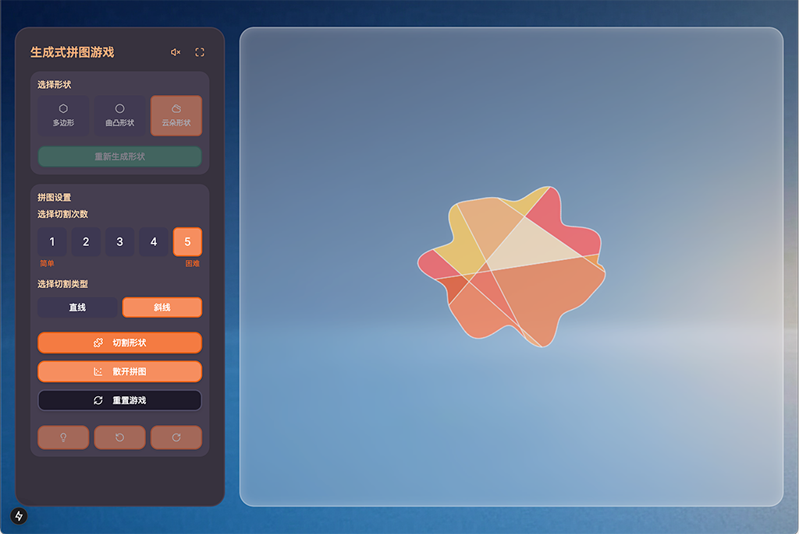

# Generative Puzzle v1.0.1

<div style="display: flex; justify-content: center; gap: 10px;">
  
  
</div>

## 项目介绍

生成式拼图游戏是一款基于Next.js和React打造的功能完整、交互丰富的应用，结合现代Web技术与精心设计的用户体验。游戏采用儿童友好的暖色系界面，通过多样化的形状生成、精确的交互控制和直观的用户界面，创造出引人入胜的拼图体验。

**核心亮点**:
- 丰富的形状生成系统，支持多边形、曲线和不规则圆形
- 精确的拖拽和旋转控制，配合角度匹配与磁吸效果
- 精美的视觉特效，包括动态阴影、玻璃效果画布、完成动画等
- 全面的音效反馈，包含交互音效和循环背景音乐
- 响应式设计，适配不同屏幕尺寸
- 专为不同年龄段用户设计，特别适合儿童探索几何和空间关系

## 功能特性

- 🎨 多种形状类型：支持多边形(5-10顶点)、曲线形状(100顶点)和不规则圆形(200顶点)生成
- ✂️ 可定制切割：支持1-5次切割和直线/斜线切割类型
- 🧩 精确角度匹配：10度精度的角度匹配系统，支持5度旋转增量
- 🖱️ 直观的拖拽和旋转交互：精确的点击检测和操作反馈
- ✨ 精美视觉特效：
  - 游戏背景图
  - 半透明玻璃效果画布，透出背景图
  - 动态拼图阴影 (散开时显示，完成时消失)
  - 星星、彩带、动态颜色变化的完成动画
- 🎯 磁吸效果和位置提示系统：帮助用户找到正确位置
- 🔊 音效反馈系统：
  - 点击、选择、吸附、完成和旋转等操作音效
  - 循环播放的lo-fi风格背景音乐
  - 控制面板提供背景音乐开关按钮
- 🌈 儿童友好的暖色系界面：简洁且吸引人的设计
- 🚀 美观的加载页面：提供进度条和动画拼图碎片
- 📱 优化的屏幕适配：自动调整拼图大小和位置，响应不同尺寸屏幕
- 🔄 智能的拼图分布：使用网格布局系统，避免拼图超出画布边界

## 技术栈

- **前端框架**: Next.js 15.1.0，React 19
- **UI组件**: Radix UI + Shadcn UI
- **样式**: Tailwind CSS
- **状态管理**: React Context + useReducer (单向数据流)
- **类型检查**: TypeScript
- **渲染技术**: HTML Canvas API (多层画布结构)
- **构建优化**: 并行服务器编译
- **动画效果**: CSS动画 + Canvas绘图

## 运行环境

- **开发服务器**: localhost:3001-3003 (自动端口分配)
- **运行模式**: 开发模式 (npm run dev)
- **构建优化**: 并行服务器编译、WebPack构建优化
- **主要目标平台**: 现代桌面浏览器和移动设备

## 游戏流程

1. **选择形状类型**: 从多边形、曲线形状和不规则形状中选择
2. **生成形状**: 点击"生成形状"按钮创建所选类型的形状
3. **设置切割参数**: 选择切割次数(1-5次)和切割类型(直线/斜线)
4. **生成拼图**: 点击"切割形状"按钮将形状切割成拼图片段
5. **散开拼图**: 点击"散开拼图"按钮将拼图片段随机分布在画布上 (此时出现阴影)
6. **解决拼图**: 拖拽和旋转拼图片段，将它们放回正确位置 (完成的拼图阴影消失)
7. **完成游戏**: 所有拼图片段正确放置后，触发完成动画和音效
8. **控制背景音乐**: 点击控制面板右上角的喇叭图标可开关背景音乐

## 核心模块

### 1. GameContext

游戏的核心状态管理系统。

**主要功能**：
- 管理游戏所有状态，包括形状、拼图、拖拽、完成状态、散开状态(`isScattered`)等
- 提供状态更新接口
- 集中处理游戏逻辑操作
- 管理画布尺寸信息和屏幕适配

### 2. PuzzleCanvas

画布渲染和交互处理的核心组件。

**主要功能**：
- 多层画布结构
- 实现拖拽、点击检测、碰撞检测等交互
- 渲染视觉元素，包括形状、拼图（含动态阴影）、辅助元素
- 处理完成状态的特效动画
- 动态响应窗口尺寸变化
- 实现拼图碰撞检测和吸附效果

### 3. 加载系统

由`LoadingScreen`和`LoadingScreenStatic`组件组成的加载体验优化系统。

**主要功能**：
- 显示标题和品牌标识
- 动态进度条
- 动画拼图碎片背景
- 静态与动态加载页面无缝过渡
- 超时保护机制

### 4. 音效系统

提供游戏中各种交互的声音反馈。

**支持的音效类型**：
- 按钮点击音效
- 拼图选择音效
- 拼图吸附音效
- 拼图完成音效
- 拼图旋转音效
- 循环背景音乐 (可通过按钮控制)

## 工具类

### 1. ShapeGenerator
负责生成各种类型的形状。

### 2. PuzzleGenerator
负责将形状切割成拼图片段。

### 3. 切割系统
提供多种切割方式。

### 4. ScatterPuzzle
负责拼图片段的打散布局。

### 5. SoundEffects
管理所有音效播放，包括交互音效和背景音乐控制。

## 界面设计

游戏采用儿童友好的暖色系界面设计，主要包括以下元素：

- **背景**: 使用`bg.jpg`作为全屏背景图
- **左侧控制面板**：包含形状选择、切割设置、游戏控制按钮和背景音乐开关
- **右侧画布区域**：半透明玻璃效果，展示形状和拼图
- **完成特效**：包括星星、彩带和祝贺文字

## 技术亮点

- **多层画布结构**：提高渲染效率
- **高效状态管理**：Context API + useReducer
- **响应式设计**：适应不同屏幕
- **精确的碰撞检测**：准确识别点击和吸附
- **深度复制技术**：确保状态更新不互相影响
- **动态视觉效果**：背景图、玻璃效果、动态阴影
- **完整的音效系统**：交互音效 + 可控背景音乐

## 优化项目结构

```
generative-puzzle/
├── app/                      # Next.js App Router 文件
│   ├── globals.css           # 全局样式 (含圆角修复, 玻璃效果)
│   ├── layout.tsx            # 根布局组件
│   └── page.tsx              # 主页面组件（优化加载体验）
├── components/               # UI组件
│   ├── ui/                   # 基础UI组件 (Shadcn UI)
│   ├── loading/              # 加载相关组件
│   │   ├── LoadingScreen.tsx # 动态加载页面组件
│   │   └── LoadingScreenStatic.tsx # 静态加载页面组件
│   ├── PuzzleCanvas.tsx      # 画布渲染组件（响应式, 透明背景, 动态阴影）
│   ├── PuzzleControls.tsx    # 拼图控制组件（优化文字, 背景音乐控制）
│   ├── ShapeControls.tsx     # 形状控制组件
│   └── theme-provider.tsx    # 主题提供组件
├── contexts/                 # 状态管理
│   └── GameContext.tsx       # 游戏状态管理（含画布尺寸, isScattered状态）
├── hooks/                    # 自定义React钩子
│   ├── use-mobile.tsx        # 移动设备检测
│   └── use-toast.ts          # Toast通知
├── lib/                      # 通用工具函数
│   └── utils.ts              # 工具函数
├── public/                   # 静态资源
│   ├── bg.jpg                # 游戏背景图
│   ├── puzzle-pieces.mp3     # 循环背景音乐
│   ├── puzzle-preview01.png  # 预览图片1
│   └── puzzle-preview02.png  # 预览图片2
├── types/                    # 类型定义
│   └── types.ts              # 共享类型
└── utils/                    # 游戏逻辑工具
    ├── constants.ts          # 常量定义
    ├── helper.ts             # 通用辅助函数
    ├── shape/                # 形状相关工具
    │   ├── ShapeGenerator.ts # 形状生成器
    │   └── geometryUtils.ts  # 几何计算工具
    ├── puzzle/               # 拼图相关工具
    │   ├── PuzzleGenerator.ts# 拼图生成器 
    │   ├── ScatterPuzzle.ts  # 拼图打散工具（优化分布算法）
    │   ├── cutGenerators.ts  # 切割线生成器
    │   └── puzzleUtils.ts    # 拼图操作工具
    └── rendering/            # 渲染相关工具
        └── soundEffects.ts   # 音效处理 (含背景音乐控制)
```

## 安装说明

1. 克隆仓库
```bash
git clone https://github.com/recohcity/generative-puzzle.git
cd generative-puzzle
```

2. 安装依赖
```bash
npm install
```

3. 启动开发服务器
```bash
npm run dev
```

4. 构建生产版本
```bash
npm run build
```

## 使用说明

1. 启动应用后，访问 `http://localhost:3001`（或自动分配的端口）
2. 首次加载时会显示游戏加载页面和进度条
3. 加载完成后，使用左侧控制面板选择形状类型和切割设置
4. 生成形状后进行切割，然后进行拼图游戏
5. 拖拽和旋转拼图块，使用提示功能辅助完成
6. 完成拼图后欣赏完成特效
7. 点击控制面板右上角的喇叭图标可开关背景音乐

## 最新优化

下面是游戏项目最近的优化改进：

- **视觉效果增强**：
  - 添加了全屏背景图 (`bg.jpg`)
  - 画布实现了半透明玻璃效果，透出背景图
  - 为拼图添加了动态阴影效果 (散开时显示，选中时增强，完成时消失)
  - 修复了圆角元素边缘的透明区域问题

- **音频体验提升**：
  - 添加了循环播放的lo-fi风格背景音乐 (`puzzle-pieces.mp3`)
  - 在控制面板添加了背景音乐开关按钮

- 加载体验优化：
  - 添加静态和动态加载屏幕组件，实现无闪烁过渡
  - 进度条平滑增长，提供更好的用户体验
  - 优化资源加载顺序，加速首次渲染时间
  - 添加超时保护机制，确保加载过程不会卡住

- 画布和拼图适配优化：
  - 自动检测并适应屏幕尺寸
  - 动态调整拼图大小和位置
  - 响应窗口尺寸变化，重新计算画布设置

- 拼图分布优化：
  - 改进的网格布局系统
  - 动态安全边距计算
  - 确定性的位置和旋转分布
  - 防止拼图超出画布边界的保护措施

- 游戏面板文字优化：
  - 更直观的按钮标签
  - 清晰的游戏状态指示
  - 更详细的用户提示信息

- 文件组织优化：
  - 将相关功能组件按功能分组
  - 将工具函数按领域分类
  - 提高代码可维护性和可读性

## 贡献指南

欢迎提交Issue和Pull Request来帮助改进项目。在提交PR之前，请确保：

1. 代码符合项目的编码规范
2. 所有测试都通过
3. 更新了相关文档

## 许可证

MIT License

## 联系方式

如有任何问题或建议，欢迎通过GitHub Issues联系我们。 