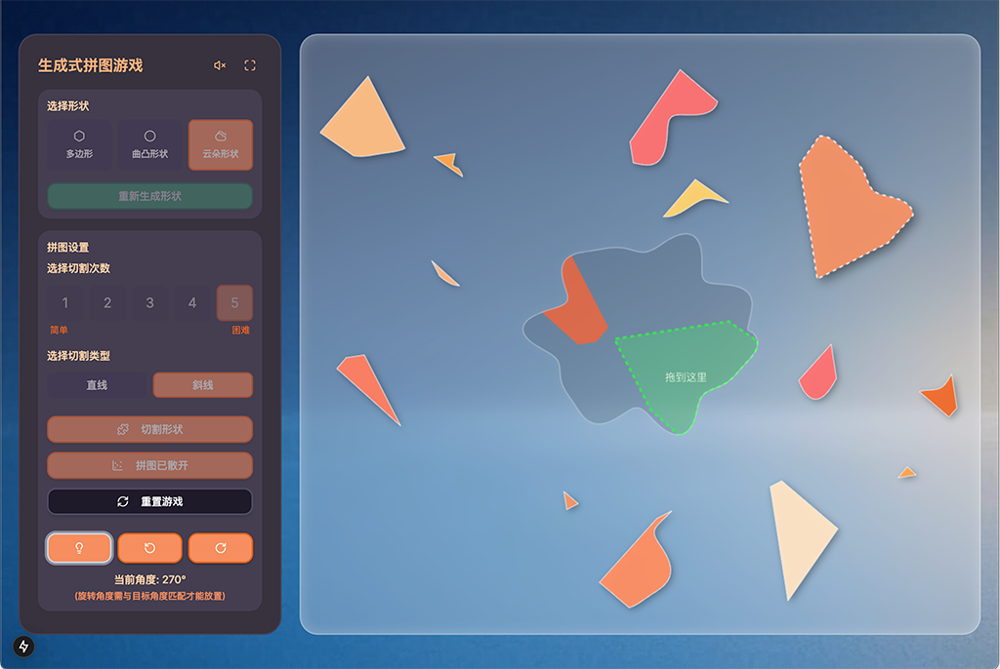

# Generative Puzzle v1.2.0

<div style="display: flex; justify-content: center; gap: 10px;">
  
  
</div>

## 项目介绍

生成式拼图游戏是一款基于Next.js和React打造的功能完整、交互丰富的应用，结合现代Web技术与精心设计的用户体验。游戏采用儿童友好的暖色系界面，通过多样化的形状生成、精确的交互控制和直观的用户界面，创造出引人入胜的拼图体验。

**核心亮点**:
- 丰富的形状生成系统，支持多边形、曲线和不规则圆形
- 精确的拖拽和旋转控制，配合角度匹配与磁吸效果
- 精美的视觉特效，包括动态阴影、玻璃效果画布、完成动画等
- 全面的音效反馈，包含交互音效和循环背景音乐
- 响应式设计，适配不同屏幕尺寸
- 专为不同年龄段用户设计，特别适合儿童探索几何和空间关系
- 全面的移动端支持，适配iPad和手机触摸设备，支持触摸拖拽和双指旋转

## 功能特性

- 🎨 多种形状类型：支持多边形(5-10顶点)、曲线形状(100顶点)和不规则圆形(200顶点)生成
- ✂️ 可定制切割：支持1-8次切割和直线/曲线切割类型 (高难度切割产生更多拼图)
- 🧩 精确角度匹配：通过旋转按钮实现15度增量旋转，配合磁吸效果实现精确归位
- 🖱️ 直观的拖拽和旋转交互：精确的点击检测和操作反馈
- 📱 移动设备触摸支持：
  - 手指拖拽拼图片段
  - 双指旋转拼图功能
  - 优化的全屏模式体验
  - 设备自适应的音量控制
  - 防止浏览器意外退出全屏的触摸事件处理
  - 手机竖屏模式特别优化
  - 修复触摸后选中状态丢失问题
  - 移除点击空白区域取消选中的逻辑
- ✨ 精美视觉特效：
  - 游戏背景图
  - 半透明玻璃效果画布，透出背景图
  - 动态拼图阴影 (散开时显示，完成时消失)
  - 星星、彩带、动态颜色变化的完成动画
  - 统一并优化游戏完成提示文字效果
- 🎯 磁吸效果和位置提示系统：帮助用户找到正确位置
- 🔊 音效反馈系统：
  - 点击、选择、吸附、完成和旋转等操作音效
  - 循环播放的lo-fi风格背景音乐
  - 控制面板提供背景音乐开关按钮
  - 设备自适应音量控制，优化移动设备体验
- 🌈 儿童友好的暖色系界面：简洁且吸引人的设计
- 🚀 美观的加载页面：提供进度条和动画拼图碎片
- 📱 优化的屏幕适配：自动调整拼图大小和位置，响应不同尺寸屏幕
- 🔄 智能的拼图分布：使用网格布局系统和螺旋分布算法，避免拼图超出画布边界
- 🖼️ 全屏模式支持：便于在移动设备上沉浸式游戏体验

## 技术栈

- **前端框架**: Next.js 15.1.0，React 19
- **UI组件**: Radix UI + Shadcn UI
- **样式**: Tailwind CSS
- **状态管理**: React Context + useReducer (单向数据流)
- **类型检查**: TypeScript
- **渲染技术**: HTML Canvas API (多层画布结构)
- **触摸交互**: Touch Events API，手势识别
- **构建优化**: 并行服务器编译
- **动画效果**: CSS动画 + Canvas绘图

## 运行环境

- **开发服务器**: localhost:3001-3003 (自动端口分配)
- **运行模式**: 开发模式 (npm run dev)
- **构建优化**: 并行服务器编译、WebPack构建优化
- **主要目标平台**: 现代桌面浏览器和移动设备（包括iPad和手机）

## 游戏流程

1. **选择形状类型**: 从多边形、曲线形状和不规则形状中选择
2. **生成形状**: 点击"生成形状"按钮创建所选类型的形状
3. **设置切割参数**: 选择切割次数(1-5次)和切割类型(直线/斜线)
4. **生成拼图**: 点击"切割形状"按钮将形状切割成拼图片段
5. **散开拼图**: 点击"散开拼图"按钮将拼图片段随机分布在画布上 (此时出现阴影)
6. **解决拼图**: 拖拽和旋转拼图片段，将它们放回正确位置 (完成的拼图阴影消失)
7. **完成游戏**: 所有拼图片段正确放置后，触发完成动画和音效
8. **控制背景音乐**: 点击控制面板右上角的喇叭图标可开关背景音乐
9. **全屏模式**: 点击全屏按钮可切换全屏游戏体验，特别优化移动设备

## 核心模块

### 1. GameContext

游戏的核心状态管理系统。

**主要功能**：
- 管理游戏所有状态，包括形状、拼图、拖拽、完成状态、散开状态(`isScattered`)等
- 提供状态更新接口
- 集中处理游戏逻辑操作
- 管理画布尺寸信息和屏幕适配

### 2. PuzzleCanvas

画布渲染和交互处理的核心组件。

**主要功能**：
- 多层画布结构
- 实现拖拽、点击检测、碰撞检测等交互
- 渲染视觉元素，包括形状、拼图（含动态阴影）、辅助元素
- 处理完成状态的特效动画
- 动态响应窗口尺寸变化
- 实现拼图碰撞检测和吸附效果
- 支持触摸屏交互，包括拖拽和双指旋转

### 3. 加载系统

由`LoadingScreen`和`LoadingScreenStatic`组件组成的加载体验优化系统。

**主要功能**：
- 显示标题和品牌标识
- 动态进度条
- 动画拼图碎片背景
- 静态与动态加载页面无缝过渡
- 超时保护机制

### 4. 音效系统

提供游戏中各种交互的声音反馈。

**支持的音效类型**：
- 按钮点击音效
- 拼图选择音效
- 拼图吸附音效
- 拼图完成音效
- 拼图旋转音效
- 循环背景音乐 (可通过按钮控制)
- 设备自适应音量调节

### 5. 移动设备优化

专为触摸屏设备设计的交互优化。

**主要功能**：
- 触摸拖拽操作支持
- 双指旋转拼图功能
- 针对不同设备的音量自适应调整
- 全屏模式增强，防止意外退出
- 触摸事件处理优化，解决常见移动端问题
- 移动设备视口meta标签优化
- 针对手机竖屏模式的特殊优化

## 工具类

### 1. ShapeGenerator
负责生成各种类型的形状。

### 2. PuzzleGenerator
负责将形状切割成拼图片段。

### 3. 切割系统
提供多种切割方式。

### 4. ScatterPuzzle
负责拼图片段的打散布局，针对手机端使用特殊的螺旋形分布算法。

### 5. SoundEffects
管理所有音效播放，包括交互音效和背景音乐控制。

## 界面设计

游戏采用儿童友好的暖色系界面设计，主要包括以下元素：

- **背景**: 使用`bg.jpg`作为全屏背景图
- **左侧控制面板**：包含形状选择、切割设置、游戏控制按钮和背景音乐开关
- **右侧画布区域**：半透明玻璃效果，展示形状和拼图
- **完成特效**：包括星星、彩带和祝贺文字

## 技术亮点

- **多层画布结构**：提高渲染效率
- **高效状态管理**：Context API + useReducer
- **响应式设计**：适应不同屏幕
- **触摸交互处理**：优化移动设备体验
- **精确的碰撞检测**：准确识别点击和吸附
- **深度复制技术**：确保状态更新不互相影响
- **动态视觉效果**：背景图、玻璃效果、动态阴影
- **完整的音效系统**：交互音效 + 可控背景音乐
- **设备自适应**：针对不同设备类型的优化
- **智能拼图分布**：针对手机端的螺旋形分布算法

## 最新优化 (v1.2.0)

本版本重点完善了难度系统，修复了交互问题，并提升了视觉一致性：

- **难度系统细化**：
  - 切割次数扩展至1-8次，高难度级别（6-8次）会生成更多拼图（9、12、14块）
  - 创建了详细的难度设计文档 (`docs/difficulty-design.md`)

- **散开逻辑优化**：
  - 修复了散开拼图时旋转角度非15度倍数的问题，确保所有拼图都能通过按钮旋转归位
  - 实现了散开时智能避开目标形状区域的功能，使拼图分布更合理

- **移动端交互修复**：
  - 解决了移动设备上触摸结束后拼图失去选中状态的问题
  - 优化了交互逻辑，点击或触摸空白画布不再取消选中状态

- **视觉效果统一**：
  - 统一并优化了游戏完成提示文字(“你好犀利吖!”)的字体和渲染效果，确保跨设备一致性

## 早期优化 (v1.1.1)

移动设备交互体验全面升级：

- **触摸操作支持**：
  - 实现单指拖拽拼图功能，精确定位
  - 添加双指旋转拼图功能，直观操控
  - 优化触摸事件处理，解决冲突问题

- **全屏体验增强**：
  - 智能阻止向下滑动导致退出全屏的问题
  - 在控制面板添加全屏切换按钮
  - 针对iOS设备的全屏模式特别优化

- **音频体验优化**：
  - 设备类型自适应的音量控制
  - 为iPad/iPhone设备设置更合适的音量级别
  - 修复移动设备上的音效播放问题

- **触摸界面优化**：
  - 防止浏览器默认的滚动和缩放行为
  - 确保按钮和控件在触摸设备上正常工作
  - 添加移动设备meta标签，优化视口设置

这些优化使得游戏在各种移动设备上提供更加流畅、直观和沉浸式的体验。

## 安装说明

1. 克隆仓库
```bash
git clone https://github.com/recohcity/generative-puzzle.git
cd generative-puzzle
```

2. 安装依赖
```bash
npm install
```

3. 启动开发服务器
```bash
npm run dev
```

4. 构建生产版本
```bash
npm run build
```

## 使用说明

1. 启动应用后，访问 `http://localhost:3001`（或自动分配的端口）
2. 首次加载时会显示游戏加载页面和进度条
3. 加载完成后，使用左侧控制面板选择形状类型和切割设置
4. 生成形状后进行切割，然后进行拼图游戏
5. 拖拽和旋转拼图块，使用提示功能辅助完成
6. 完成拼图后欣赏完成特效
7. 点击控制面板右上角的喇叭图标可开关背景音乐
8. 点击全屏按钮可切换全屏模式，在移动设备上获得更好体验

## 贡献指南

欢迎提交Issue和Pull Request来帮助改进项目。在提交PR之前，请确保：

1. 代码符合项目的编码规范
2. 所有测试都通过
3. 更新了相关文档

## 许可证

MIT License

## 联系方式

如有任何问题或建议，欢迎通过GitHub Issues联系我们。 