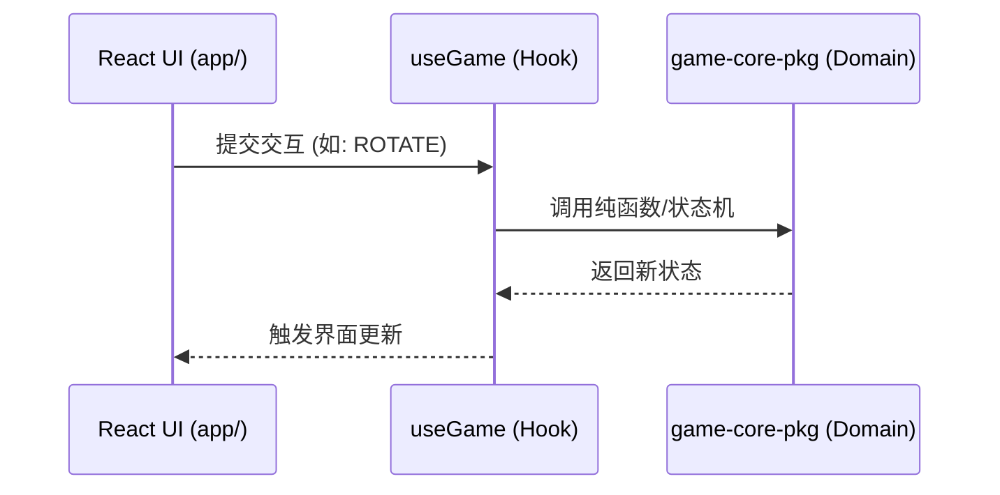
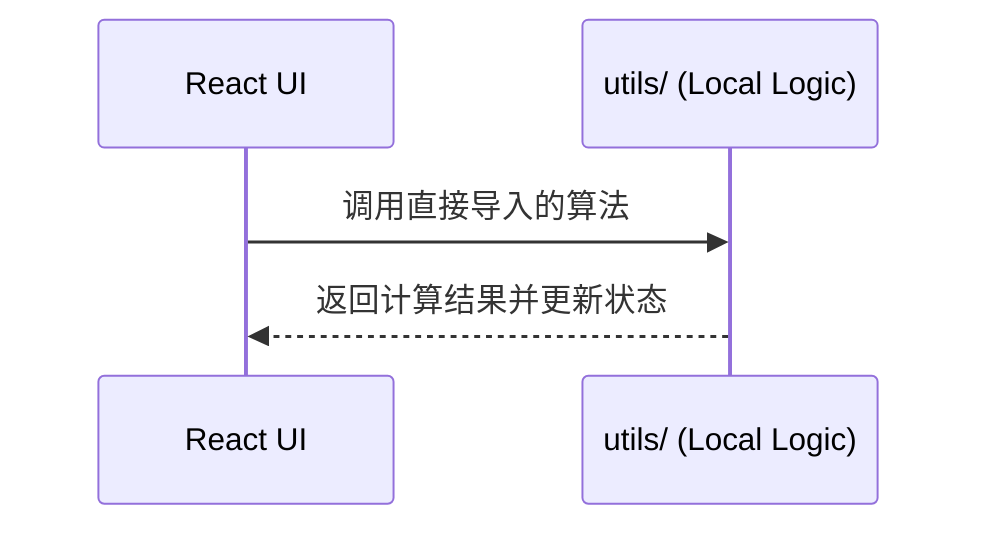

# Generative Puzzle 核心架构与多分支演进指南（2026）

本文定义了项目的两种并存架构形态、核心数据动线以及分支协作规范，是项目的单一事实来源。

---

## 1. 系统架构：双轨分层 (Asymmetric Architecture)

项目当前保持着一套“主线进阶”与“单机纯净”并存的架构模式：

### 1.1 `main` & `game-cloud` (分层架构 / Monorepo)

- **核心包 (`packages/game-core`)**：存放拼图算法、几何计算、分值公式及状态机。纯 TS 实现，无外部侧重依赖。
- **应用层 (Next.js Root)**：负责集成 Auth、云端同步钩子 (`useCloudSync`) 以及 Vercel 性能监控。
- **定位**：云端全功能版；面向多端同步、排行榜及长期用户资产沉淀。

### 1.2 `game-only` (扁平架构 / Standalone)

- **架构形态**：保留了**传统的扁平化结构 (Legacy Flat)**，不包含 `packages/` 体系。
- **依赖管理**：极简依赖，不包含 Supabase 或 Vercel Speed Insights 等云端 SDK。
- **定位**：纯前端单机版；面向 GitHub Pages 静态分发、低延时本地体验及完全匿名隐私场景。

---

## 2. 核心逻辑动线 (Logic Flow)

### 2.1 主线 Monorepo 逻辑 (main/game-cloud)

### 2.2 离线版扁平逻辑 (game-only)

---

---

## 6. 部署环境与基础设施 (Infrastructure)

项目采用“云端统一、分支隔离”的部署策略，确保开发与生产环境的数据一致性。

### 6.1 部署矩阵与数据库映射

| 环境 (Environment) | Git 分支 | 托管平台 | 数据库 (Supabase) | 监控与日志 |
|---|---|---|---|---|
| **Production (生产)** | **`main`** | **Vercel** (`prod`) | **Unified Project** (`wjewwm`) | Speed Insights, RUM |
| **Preview (预览)** | **`game-cloud`** | **Vercel** (`preview`) | **Unified Project** (`wjewwm`) | Vercel Logs |
| **Static (单机版)** | **`game-only`** | **GH Pages** (`static`) | **None (零数据库连接)** | 无 |

> [!NOTE]
> **统一数据库模型 (Unified DB)**: 为了简化数据迁移与管理成本，目前 `main` 与 `game-cloud` 共享同一 Supabase 项目 (`ref: wjewwmffsutxqvqokglr`)。通过 Vercel 环境控制台注入 `NEXT_PUBLIC_SUPABASE_URL`。

### 6.2 CI/CD 生命周期

1. **开发态**：在 `game-cloud` 或 Feature 分支进行功能开发，自动触发 Vercel Preview 部署并连接共享数据库。
2. **生产态**：Merge 至 `main` 后，Vercel 自动执行生产构建与部署。
3. **单机态**：同步逻辑至 `game-only` 分支，执行静态导出 (`next export`) 发布至 GitHub Pages。

---

## 7. 开发规范与协作准则

1. **核心同步**：凡涉及 `packages/game-core` 的算法变更，需在主线验证通过后，同步至 `game-only` 的 `utils/` 目录中。
2. **零副作用**：核心算法包内严禁引用 `window`、`localStorage` 或云端 SDK。
3. **性能红线 (Mobile LCP)**：主线版本需严格维持 **LCP < 4.5s** 的标准，优化策略包括 `display: swap` 和 `optimizePackageImports`。
4. **环境安全**：严禁在 `game-only` 分支中引入任何会暴露 Supabase Key 或触发云端请求的逻辑。

---

*修订记录：2026-04-04 | v1.6 | 更新内容：整理全分支部署环境、统一数据库映射与 CI/CD 动线*
