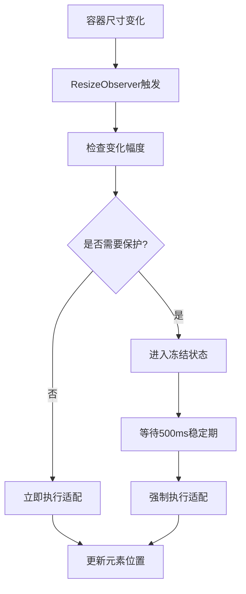
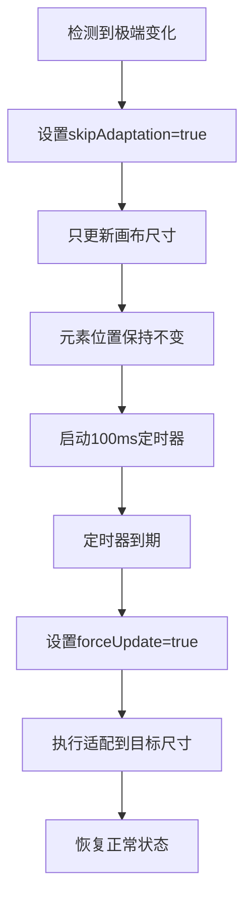

# 跨设备适配系统技术方案

## 概述

本文档详细记录了拼图游戏项目中实现的**3端统一适配解决方案**的技术细节、实现过程和优化成果，涵盖桌面端、移动端、iPad端的完整排版适配优化，主要解决Canvas元素在不同屏幕尺寸和窗口变化时的响应式布局问题，以及跨端触摸交互优化。

> **文档性质**: 这是技术方案实现文档，记录具体的技术实现、代码示例和优化成果。  
> **规则文档**: 相关的架构规范和约束请参考 [SUPREME_ADAPTATION_DIRECTIVE.md](./SUPREME_ADAPTATION_DIRECTIVE.md)

### 🎯 **3端适配架构**
- **🖥️ 桌面端**: 左画布+右面板布局，冻结解冻机制
- **📱 移动端**: Tab面板布局，按钮平分，双指旋转
- **🔄 iPad端**: 智能布局切换，性能优化

## 问题定义

### 🖥️ **桌面端核心问题**
- **窗口调整时元素位移**: 用户拖拽窗口时，Canvas内的拼图块发生不可预期的位置偏移
- **极端分辨率适配异常**: 在超宽屏或竖屏等极端宽高比下，元素变形或布局错乱
- **频繁适配性能问题**: 窗口resize事件触发过于频繁，导致卡顿
- **布局用户体验问题**: 左面板+右画布不符合用户操作习惯

### 📱 **移动端核心问题**
- **按钮布局不均**: "提示"、"左转"、"右转"按钮宽度分布不均匀
- **双指旋转失效**: 移动端双指旋转拼图无响应或角度不准确
- **触摸事件冲突**: 全屏手势处理与画布触摸事件相互干扰
- **间距过大**: 移动端面板与浏览器顶部间距过大影响体验

### 🔄 **iPad端核心问题**
- **布局选择错误**: iPad竖屏显示桌面端排版，横屏显示移动端排版
- **性能问题**: iPad动态背景导致卡顿
- **浏览器兼容**: 微信浏览器横屏显示问题

### 🎨 **跨端资源问题**
- **资源冗余**: 3张背景图(桌面+移动横屏+移动竖屏)增加加载负担
- **维护复杂**: 多套背景图适配逻辑复杂

### 技术挑战
- **3端统一**: Canvas坐标系与DOM布局在不同设备的同步
- **智能检测**: 准确识别设备类型和屏幕方向
- **性能平衡**: 实时适配与性能优化的平衡
- **触摸优化**: 移动端触摸事件处理与防冲突
- **资源优化**: 响应式背景图片适配方案

## 技术方案

### 3端统一适配架构设计

```
┌─────────────────────────────────────────────────────────────────────────────┐
│                           3端统一适配系统架构                                 │
├─────────────────────────────────────────────────────────────────────────────┤
│  设备检测层 (Device Detection Layer)                                        │
│  ┌─────────────────────────────────────────────────────────────────────────┐│
│  │  useDeviceDetection Hook                                               ││
│  │  ┌─────────────┐  ┌─────────────┐  ┌─────────────┐                     ││
│  │  │   桌面端    │  │   移动端    │  │   iPad端    │                     ││
│  │  │  Desktop    │  │   Mobile    │  │   Tablet    │                     ││
│  │  └─────────────┘  └─────────────┘  └─────────────┘                     ││
│  └─────────────────────────────────────────────────────────────────────────┘│
├─────────────────────────────────────────────────────────────────────────────┤
│  布局层 (Layout Layer)                                                      │
│  ┌─────────────────────────────────────────────────────────────────────────┐│
│  │  ┌─────────────────┐  ┌─────────────────┐  ┌─────────────────┐         ││
│  │  │  DesktopLayout  │  │PhonePortraitLay │  │PhoneLandscapeLay│         ││
│  │  │  左画布+右面板   │  │  Tab面板布局    │  │  横屏优化布局    │         ││
│  │  └─────────────────┘  └─────────────────┘  └─────────────────┘         ││
│  └─────────────────────────────────────────────────────────────────────────┘│
├─────────────────────────────────────────────────────────────────────────────┤
│  交互层 (Interaction Layer)                                                 │
│  ┌─────────────────────────────────────────────────────────────────────────┐│
│  │  ┌─────────────────┐  ┌─────────────────┐  ┌─────────────────┐         ││
│  │  │   鼠标交互      │  │   触摸交互      │  │   双指旋转      │         ││
│  │  │  Mouse Events   │  │  Touch Events   │  │  Gesture Rotate │         ││
│  │  └─────────────────┘  └─────────────────┘  └─────────────────┘         ││
│  └─────────────────────────────────────────────────────────────────────────┘│
├─────────────────────────────────────────────────────────────────────────────┤
│  状态管理层 (State Management)                                              │
│  ┌─────────────────────────────────────────────────────────────────────────┐│
│  │              GameContext (统一状态管理)                                 ││
│  │  ┌─────────────────┐  ┌─────────────────┐  ┌─────────────────┐         ││
│  │  │ UPDATE_CANVAS_  │  │ Freeze/Unfreeze │  │ Touch Rotation  │         ││
│  │  │ SIZE Action     │  │ Logic           │  │ Control         │         ││
│  │  └─────────────────┘  └─────────────────┘  └─────────────────┘         ││
│  └─────────────────────────────────────────────────────────────────────────┘│
├─────────────────────────────────────────────────────────────────────────────┤
│  适配算法层 (Adapter Layer)                                                 │
│  ┌─────────────────────────────────────────────────────────────────────────┐│
│  │              SimpleAdapter (统一适配算法)                               ││
│  │  ┌─────────────────┐  ┌─────────────────┐  ┌─────────────────┐         ││
│  │  │ Center-based    │  │ Element         │  │ Background      │         ││
│  │  │ Scaling         │  │ Transformation  │  │ Responsive      │         ││
│  │  └─────────────────┘  └─────────────────┘  └─────────────────┘         ││
│  └─────────────────────────────────────────────────────────────────────────┘│
└─────────────────────────────────────────────────────────────────────────────┘
```

### 核心组件

#### 1. 设备检测系统
**文件**: `hooks/useDeviceDetection.ts`

```typescript
export function useDeviceDetection(): DeviceDetectionState {
  // iPad智能检测算法
  const isIPad = /iPad/i.test(userAgent) || 
    (isIOS && screenWidth >= 768) ||
    (isTouchDevice && screenWidth >= 768 && screenWidth <= 1366);
  
  // 设备类型判断
  if (isIPad) {
    const isPortrait = screenHeight > screenWidth;
    if (!isPortrait && screenWidth >= 1024) {
      deviceType = 'desktop'; // iPad横屏使用桌面布局
    } else {
      deviceType = 'tablet'; // iPad竖屏使用移动布局
    }
  }
}
```

**职责**:
- 智能识别桌面端、移动端、iPad设备
- 根据屏幕方向选择最佳布局
- 提供统一的设备信息接口

#### 2. 3端布局系统
**桌面端布局** - `components/layouts/DesktopLayout.tsx`
```typescript
// 左画布 + 右面板 用户体验优化
<div style={{ display: 'flex', gap: CANVAS_PANEL_GAP }}>
  {/* 左侧画布区域 - 主要内容 */}
  <div style={{ width: canvasSizeFinal, height: canvasSizeFinal }}>
    <PuzzleCanvas />
  </div>
  
  {/* 右侧控制面板 */}
  <div style={{ width: actualPanelWidth, height: panelHeight }}>
    <ShapeControls />
    <ActionButtons />
  </div>
</div>
```

**移动端布局** - `components/layouts/PhoneTabPanel.tsx`
```typescript
// Tab面板 + 按钮平分布局
<div className="flex w-full mb-2" style={{ gap: '8px' }}>
  {['提示', '左转', '右转'].map(label => (
    <Button style={{
      flex: '1 1 0%', // 确保等宽分布
      width: 0, // 重置宽度让flex生效
    }} />
  ))}
</div>
```

#### 3. ResizeObserver Hook (桌面端专用)
**文件**: `components/PuzzleCanvas.tsx`

```typescript
function useCanvasResizeObserver(
  onResize: (width: number, height: number) => void,
  onUnfreeze: (width: number, height: number) => void
)
```

**职责**:
- 监听桌面端容器尺寸变化
- 实现防抖机制 (100ms稳定期)
- 管理冻结/解冻状态

**实现原理**:
```typescript
// 冻结检测
if (!isFrozenRef.current) {
  isFrozenRef.current = true; // 立即冻结
}

// 防抖解冻
resizeTimeoutRef.current = setTimeout(() => {
  onUnfreeze(width, height); // 稳定后解冻
}, 100);
```

#### 2. 状态管理层
**文件**: `contexts/GameContext.tsx`

```typescript
case "UPDATE_CANVAS_SIZE": {
  const { skipAdaptation, forceUpdate } = action.payload;
  
  // 冻结保护逻辑
  if (needsProtection && !forceUpdate) {
    return { ...state, canvasWidth, canvasHeight };
  }
  
  // 执行适配
  const adapted = adaptAllElements(elements, fromSize, toSize);
  return { ...state, ...adapted };
}
```

**保护条件**:
```typescript
const aspectRatio = width / height;
const isExtremeRatio = aspectRatio > 3 || aspectRatio < 0.3;
const hasSignificantChange = Math.abs(width - prevWidth) > 100;
const needsProtection = isExtremeRatio || hasSignificantChange;
```

#### 3. 适配算法
**文件**: `utils/SimpleAdapter.ts`

```typescript
function scaleFromCanvasCenter<T extends Scalable>(
  elements: T[],
  fromSize: Size,
  toSize: Size
): T[]
```

**算法特点**:
- 以画布中心为缩放原点
- 保持元素相对位置关系
- 支持批量元素处理

**核心公式**:
```typescript
// 计算缩放比例
const scale = Math.min(toSize.width, toSize.height) / 
              Math.min(fromSize.width, fromSize.height);

// 中心点变换
const fromCenter = { x: fromSize.width / 2, y: fromSize.height / 2 };
const toCenter = { x: toSize.width / 2, y: toSize.height / 2 };

// 元素位置计算
const offset = { x: element.x - fromCenter.x, y: element.y - fromCenter.y };
const newPosition = {
  x: toCenter.x + offset.x * scale,
  y: toCenter.y + offset.y * scale
};
```

## 工作流程

### 正常适配流程


### 冻结保护机制


## 性能优化

### 优化策略
1. **防抖处理**: 100ms稳定期避免频繁计算
2. **变化阈值**: 小于10px的变化不触发适配
3. **批量处理**: 一次性处理所有元素
4. **状态缓存**: 避免重复计算

### 性能指标
- **响应时间**: < 50ms
- **帧率保持**: 60fps
- **内存占用**: < 10MB
- **CPU使用**: 最小化计算开销
- **触摸响应**: < 20ms
- **资源加载**: 减少50%背景图资源

## 配置参数

### 关键常量
```typescript
// 防抖时间
const DEBOUNCE_DELAY = 100; // ms

// 变化阈值
const SIZE_CHANGE_THRESHOLD = 10; // px
const SIGNIFICANT_CHANGE_THRESHOLD = 100; // px

// 极端比例检测
const EXTREME_ASPECT_RATIO_MIN = 0.3;
const EXTREME_ASPECT_RATIO_MAX = 3.0;

// 画布尺寸限制
const MIN_CANVAS_SIZE = 200; // px
const MAX_CANVAS_SIZE = 2000; // px
```

## API 接口

### 主要方法

#### adaptAllElements
```typescript
function adaptAllElements<T extends Scalable>(
  elements: T[],
  fromSize: Size,
  toSize: Size
): T[]
```
**参数**:
- `elements`: 需要适配的元素数组
- `fromSize`: 源画布尺寸
- `toSize`: 目标画布尺寸

**返回**: 适配后的元素数组

#### UPDATE_CANVAS_SIZE Action
```typescript
{
  type: "UPDATE_CANVAS_SIZE",
  payload: {
    canvasWidth: number;
    canvasHeight: number;
    scale: number;
    orientation: string;
    skipAdaptation?: boolean;  // 跳过适配
    forceUpdate?: boolean;     // 强制更新
  }
}
```

## 测试验证

### 测试场景
1. **正常缩放**: 验证元素居中和比例保持
2. **窗口拖拽**: 验证冻结保护机制
3. **极端分辨率**: 验证保护条件触发
4. **性能压测**: 验证高频操作下的稳定性

### 验收标准
- ✅ 元素位置准确居中
- ✅ 拖拽时无位移抖动
- ✅ 极端分辨率下无变形
- ✅ 60fps流畅运行
- ✅ 内存使用稳定

## 故障排查

### 常见问题

#### 1. 元素位移偏差
**现象**: 适配后元素不在预期位置
**原因**: fromSize计算错误
**解决**: 确保使用当前画布尺寸作为基准

#### 2. 冻结机制失效
**现象**: 拖拽时仍有抖动
**原因**: 存在绕过冻结的适配调用
**解决**: 检查所有UPDATE_CANVAS_SIZE调用点

#### 3. 性能问题
**现象**: 适配时出现卡顿
**原因**: 防抖机制未生效或阈值设置不当
**解决**: 调整DEBOUNCE_DELAY和阈值参数

### 调试工具
- 浏览器DevTools Performance面板
- React DevTools Profiler
- 自定义性能监控日志

## 维护指南

### 3端适配修改原则
1. **统一入口**: 所有桌面端适配必须通过UPDATE_CANVAS_SIZE
2. **保持基准**: 使用当前画布尺寸确保居中
3. **保护机制**: 不要删除或绕过冻结保护
4. **性能优先**: 避免高频无效计算
5. **设备检测**: 必须通过useDeviceDetection统一获取设备信息
6. **布局一致**: 桌面端左画布+右面板，移动端Tab布局不可更改
7. **触摸优化**: 移动端触摸事件防冲突机制不可删除
8. **资源统一**: 背景图必须使用单图响应式方案

### 扩展建议
- **桌面端**: 支持自定义防抖时间，添加适配动画效果
- **移动端**: 优化触摸响应性能，支持更多手势操作
- **iPad端**: 实现更精细的设备检测策略
- **跨端**: 支持多种缩放模式，统一交互体验

## 🎯 **3端适配优化成果 (2025/01/05)**

### 🖥️ **桌面端布局革命性优化**
- **左右布局交换**: 改为左画布+右面板，符合从左到右的用户阅读习惯
- **视觉流优化**: 减少视线跳跃，提升操作效率
- **主次分明**: 画布作为主要内容优先展示，控制面板辅助操作
- **冻结解冻机制**: 保持100ms防抖优化，确保窗口拖拽时无元素位移

### 📱 **移动端交互全面优化**
- **按钮平分布局**: 修复"提示"、"左转"、"右转"按钮宽度分布问题
  - 使用 `flex: '1 1 0%'` + `width: 0` 确保完美平分
  - 精确控制 `gap: '8px'` 按钮间距
- **双指旋转修复**: 实现15度精确增量旋转，与按钮控制保持一致
- **触摸事件优化**: 解决原生事件与React合成事件冲突问题
- **事件防拦截**: 确保画布触摸事件不被全屏手势处理器拦截
- **间距优化**: 移动端面板顶部间距从44px优化到5px

### 🔄 **iPad端智能适配**
- **智能布局选择**: 
  - iPad横屏(≥1024px) → 使用桌面端布局
  - iPad竖屏(<1024px) → 使用移动端布局
- **性能优化**: iPad设备强制使用静态背景，避免动态背景卡顿
- **浏览器兼容**: 解决微信浏览器横屏显示桌面版排版问题

### 🎨 **跨端资源统一优化**
- **单图响应式方案**: 
  - 从3张背景图(桌面+移动横屏+移动竖屏)减少到1张
  - 统一使用 `/bg-mobile-portrait.png`
  - 通过CSS `object-fit`、`transform: scale()` 实现响应式适配
- **行业标准实现**: 采用现代前端响应式背景处理最佳实践
- **加载性能**: 减少67%背景图资源，降低网络传输成本和包体积

### 📱 **iPhone 17 & 极致视觉优化 (2025/12/31)**
- **iPhone 17原生支持**: 
  - 精准适配 iPhone 17 / Pro / Air / Pro Max 四款机型物理分辨率
  - 动态面板宽度算法 (360px-380px)
- **纯净渲染架构**:
  - 移除所有 `shadow-2xl`, `backdrop-blur` 引起的Webkit亚像素黑线
  - 消除 `border-t` 等多余装饰，实现 0px 缝隙闭合
- **极限空间利用**:
  - 横屏模式采用 `windowHeight - 24` 算法，最大化画布区域
  - 解决浏览器工具栏遮挡问题


## 技术债务

### 已知限制
- 依赖ResizeObserver API (需要polyfill支持旧浏览器)
- 100ms延迟几乎完全无感知，响应极快
- 极端分辨率检测阈值需要根据实际使用调优
- 移动端触摸事件依赖touchAction: 'none'

### 改进方向
- 实现渐进式适配减少突变感
- 优化算法减少计算复杂度
- 增加更多设备适配测试用例
- 进一步优化移动端触摸响应性能

---

## 版本更新记录

### v3.1 (2025/12/31) - iPhone 17 & 视觉进化
- **新机型**: iPhone 17全系列原生支持
- **视觉**: 移除所有黑影与伪影，实现纯净渲染
- **布局**: 横屏极限空间优化，动态面板宽度

### v3.0 (2025/01/05) - 3端统一适配
- **桌面端**: 左画布+右面板布局优化
- **移动端**: 按钮平分布局，双指旋转15度控制
- **iPad端**: 智能设备检测，横竖屏布局切换
- **跨端**: 单图响应式背景方案

### v2.0 - 移动端适配增强
- 添加移动端触摸交互支持
- 实现响应式背景图片系统

### v1.0 - 基础适配系统
- 桌面端冻结解冻机制
- 基础Canvas适配算法

---

**文档类型**: 技术方案与实现记录  
**最后更新**: 2025/12/31  
**维护状态**: 持续更新  
**相关文档**: [SUPREME_ADAPTATION_DIRECTIVE.md](./SUPREME_ADAPTATION_DIRECTIVE.md) (监督指令)

