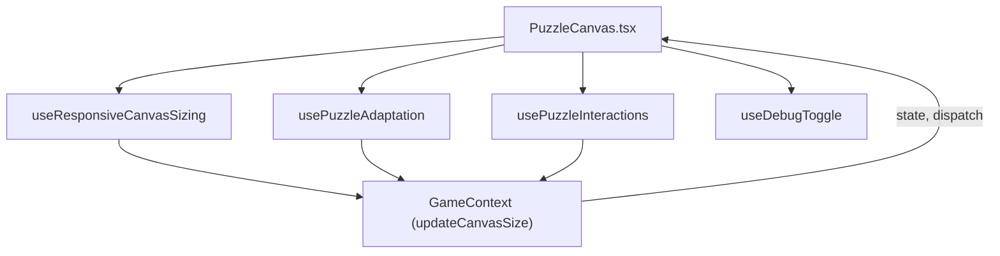

# PuzzleCanvas 依赖关系与状态分析（重构后结构专用版）

本分析基于重构后的 PuzzleCanvas 及其相关 hooks，梳理各模块间的依赖关系、状态流转和职责分工，便于与重构前的结构进行对照和测试比对。

---

## 1. 组件与 Hook 结构

- **PuzzleCanvas.tsx**
  - 仅负责渲染 `<canvas>` 元素、绑定交互事件、编排各 Hook。
  - 不再包含任何业务逻辑或状态，仅作为"胶水层"。

- **useResponsiveCanvasSizing**
  - 负责监听容器/窗口尺寸变化，动态计算并返回画布尺寸。
  - 内部自动调用 `GameContext` 的 `updateCanvasSize`，同步全局状态。

- **usePuzzleAdaptation**
  - 监听画布尺寸变化，自动计算并适配所有拼图块的新位置与旋转。
  - 通过 `dispatch` 更新 `GameContext` 中的拼图状态，确保状态记忆与恢复。

- **usePuzzleInteractions**
  - 统一管理所有交互事件（拖拽、旋转、吸附、碰撞等）。
  - 依赖 `GameContext` 的状态与方法，调用音效、边界检测等工具。

- **useDebugToggle**
  - 监听 F10 键，切换调试模式。
  - 返回 `showDebugElements` 状态，供 PuzzleCanvas 控制调试元素渲染。

---

## 2. 状态流转与依赖关系

- **GameContext** 是所有状态的唯一真实来源（Single Source of Truth），所有 hooks 通过 context 读写状态。
- **PuzzleCanvas** 只负责编排和渲染，所有业务逻辑均分散到 hooks。
- **自动化测试与调试 API** 由 GameContext 统一挂载，支持高可用的测试与开发体验。

---

## 3. 关键状态与数据流

- **canvasSize**：由 useResponsiveCanvasSizing 计算，驱动适配与绘制。
- **puzzle**：拼图块数组，所有交互、适配、绘制的核心数据。
- **showDebugElements**：调试模式开关，由 useDebugToggle 控制。
- **交互事件**：全部由 usePuzzleInteractions 统一处理，PuzzleCanvas 只做事件绑定。

---

## 4. 设计优势

- **高内聚低耦合**：每个 Hook 职责单一，易于维护和测试。
- **状态唯一性**：所有状态集中在 GameContext，避免多源同步问题。
- **自动化测试友好**：所有核心逻辑均可通过 API 稳定驱动，测试体系健全。
- **调试与扩展性强**：调试模式可随时切换，调试元素样式灵活可配。

---

> 详细类型定义见 `types/puzzleTypes.ts`，自动化测试与调试 API 见 `contexts/GameContext.tsx`。 