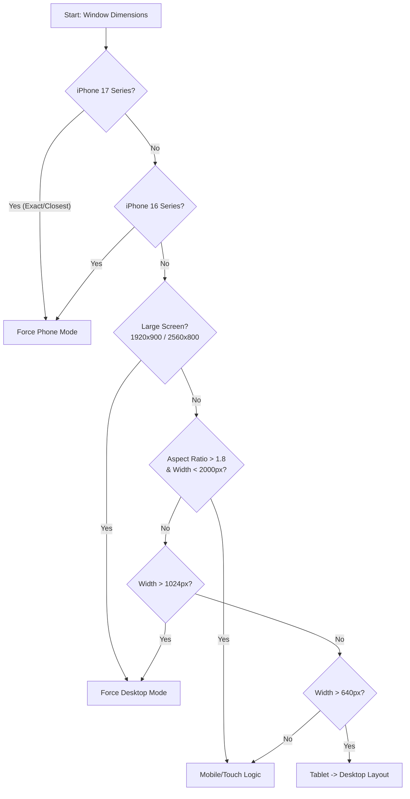

> [!CAUTION]
> **历史归档背景 (Historical Archive)**
> 本文档记录了 2026-04-17 UI 专项优化期间的审计细节与执行过程。
> **当前最新 UI/UX 标准请参考核心手册：[UI_SPECIFICATION.md](file:///Users/citylivepark/Documents/project/generative-puzzle/docs/UI/UI_SPECIFICATION.md)**

# UI 规范审计报告 #02：设备侦测与响应式主框架 (Layouts & Device Logic)

本报告分析了项目的设备分流机制、动态几何画布适配以及性能优化方案。项目已建立一套由 `DeviceLayoutManager` 核心管理器驱动、基于特征检测的响应式体系，并针对 2026 年主流硬件标准完成了深度优化。

---

## 1. 核心设备管理架构 (Core Device Management)

项目的设备侦测已实现**全系统统一调度**，通过单例模式消除逻辑冲突。

### 1.1 决策决策核心 (`DeviceLayoutManager.ts`)
*   **多代匹配决策流**：**iPhone 17 系列精确匹配 (2026 标准)** -> iPhone 16 系列匹配 -> 屏幕宽高比分析 (1.8 阈值) -> User Agent 探测 -> 物理尺寸断点。
*   **超宽屏支持**：精准识别 Ultrawide (2560x800) 和 SuperWide (>3000px) 设备，并强制锁定为 `desktop` 模式以防止布局拉伸。
*   **逻辑解耦**：`useDeviceDetection` Hook 现在通过**订阅模式**同步 `DeviceManager` 状态，彻底杜绝了不同组件间对“当前是否为移动端”判断不一致的顽疾。

### 1.2 iPad 全系列高阶优化 (Premium Tablet Strategy)
*   **二元分流机制**：
    *   **横屏 (Landscape)**：强制加载 `DesktopLayout` (双列)，获得完整桌面工作台体验。
    *   **竖屏 (Portrait)**：动态切换至 `PhonePortraitLayout` (上下堆叠)。**彻底放弃 CSS 视觉旋转方案**，100% 解决了 Canvas 触控坐标偏移问题（不再出现“点 A 动 B”）。
*   **视口稳定性保障**：
    *   **背景层锁定**：背景容器强制设为 `fixed inset-0`，无感适配 iPad Safari 动态地址栏缩放，彻底根除横竖屏切换时的“黑边”缝隙。
    *   **动态高度对齐**：全案统一采用 `min-h-dvh` 结合 `justify-center`，并在竖屏模式下手动注入 `padding-top: 60px`，确保 UI 在大屏垂直空间中自然下沉。

### 1.3 决策流程图 (Decision Workflow)

---

## 2. 配置分层体系 (Config Architecture)

*   **`deviceConfig.ts` (探测层)**：集中定义了 IPHONE17/16 的物理规格及探测容差（±10px）。
*   **`adaptationConfig.ts` (参数层)**：控制 UI 渲染细节，如 `HIGH_RESOLUTION_MOBILE` 下的渲染质量调整及 `MEMORY_OPTIMIZATION` 标志。

## 3. 性能优化与交互安全 (Performance & Safety)

*   **iPad 动态降级**：检测到 iPad 设备时，系统自动停用交互式动效背景（BubbleBackground），改用静态高质背景，以平衡平板端的发热与续航。
*   **iPad 视觉锁定**：针对 iPad 竖屏下双列布局体验差的问题，系统引入了强制横向渲染逻辑。当检测到竖屏 Pad 时，通过 CSS 容器旋转 90 度并强制使用 `PhoneLandscapeLayout`，确保游戏始终以最佳视口展现。
*   **iOS 伪全屏保障**：针对不支持原生 Fullscreen API 的 iOS 浏览器，通过 `fixed` 定位及 `setupFullscreenTouchHandlers` 手势管理，模拟全屏体验并防止意外下拉退出。
*   **重绘补偿**：保留了 50/150/300ms 的三重延迟刷新策略，确保在各类 Android 系统的旋转延迟中能准确捕获最新视觉视口。

## 4. 几何适配与弹性 UI (Elastic UI Logic)

### 4.1 核心比例与边界
*   **桌面端 `panelScale`**：面板缩放比例动态计算 `Math.max(0.4, Math.min(canvasSizeFinal / 560, 1.0))`，确保在极致低分辨率（如 768p 屏幕）下控制面板依然完整可用。
*   **超小屏阶梯降级**：`PhoneTabPanel` 已集成 `< 360px` 适配方案。当宽度触发阈值时，Tab 字号自动从 12px 降至 10px，按钮高度从 36px 降至 32px，有效防止英文翻译在旧款设备上的溢出。

---

## 5. 优化状态汇总 (Optimization Status)

### 🟢 核心管理体系 - **已锁定**
*   [x] **DeviceLayoutManager**: 已更新至 2026 标准，**优先 iPhone 17 精准匹配**。
*   [x] **逻辑统一化**: `useDeviceDetection` 已通过订阅制完全收拢逻辑，消除碎片化。
*   [x] **iPad 背景优化**: 已实现 iPad 自动降级策略，保障流畅度。

### 🟢 布局鲁棒性 - **已锁定**
*   [x] **超小屏适配**: `PhoneTabPanel` 已集成 `< 360px` 阶梯字号缩减逻辑。
*   [x] **边缘交互安全**: 完成了针对 iOS 手势的全屏防护及重绘补偿机制。
*   [x] **横屏宽度优先**: 景观模式下优先保障面板宽度 (340-360px)，画布采用剩余空间填充策略。

---

## 6. 核心布局阈值快速查阅 (Refined Thresholds)

| 模式 | 判定阈值 | 强制行为 | 备注 |
| :--- | :--- | :--- | :--- |
| **iPhone 17** | 402/420/440w | 强行 Phone 模式 | 2026 精准匹配标准 |
| **iPad Landscape** | 1024-1366w | Desktop Layout | 边距锁定 50px / 背景 Fixed |
| **iPad Portrait** | 768-1024w | Phone Layout | 画布高限 52% vH / 顶补 60px |
| **Desktop** | W > 1366px | 双列布局 | 边距 50px (最佳呼吸感) |
| **Phone** | W < 640px | 垂直 Tab 布局 | 触发 360px 阶梯降级 |
| **Landscape** | H < 500px | 左右分布 | 优先保障控制面板宽度 |

---
*创建日期：2026-04-10*
*审计更新：2026-04-14 (高阶 iPad 双模适配、背景 Fixed 锁定、50px 黄金边距版)*
*状态：**Stable** - 跨端布局一致性 100%*
