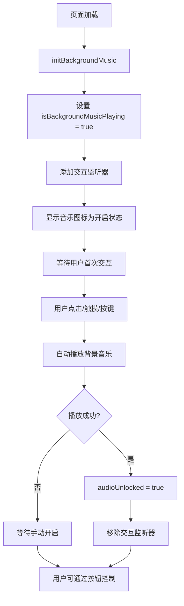

# 音效系统文档

本项目包含一个完整的音效系统，为用户交互提供音频反馈。

## 音效类型

### 1. 背景音乐
- **文件**: `/public/puzzle-pieces.mp3`
- **功能**: 循环播放的背景音乐
- **默认状态**: 🆕 **默认开启** - 提供更好的用户体验
- **自动播放**: 🆕 **智能启动** - 用户首次交互时自动开始播放
- **控制**: 可通过右上角音乐按钮随时开关
- **音量**: 0.5（适中音量，不干扰游戏操作）

### 2. 交互音效（程序生成）

#### 通用按钮点击音效 (`playButtonClickSound`)
- **触发**: 大部分按钮点击
- **特征**: 简短的正弦波音效，440Hz快速衰减到220Hz
- **持续时间**: 0.2秒

#### 拼图块选择音效 (`playPieceSelectSound`)
- **触发**: 选择拼图块时
- **特征**: 600Hz正弦波，快速衰减
- **持续时间**: 0.1秒

#### 拼图块吸附音效 (`playPieceSnapSound`)
- **触发**: 拼图块正确放置时
- **特征**: 三角波，880Hz衰减到440Hz
- **持续时间**: 0.3秒

#### 拼图完成音效 (`playPuzzleCompletedSound`)
- **触发**: 完成整个拼图时
- **特征**: 双音符和弦 (C5 + E5)
- **持续时间**: 0.75秒

#### 旋转音效 (`playRotateSound`)
- **触发**: 旋转拼图块时
- **特征**: 三角波，400Hz上升到450Hz
- **持续时间**: 0.12秒

#### 🆕 切割音效 (`playCutSound`)
- **触发**: 切割形状生成拼图时
- **特征**: 清晰简单的"咔嚓"切割音效
  - 锯齿波振荡器 - 产生锐利的切割声
  - 频率扫描 (300Hz → 1200Hz → 200Hz) - 模拟刀片切割过程
  - 瞬间攻击和快速衰减 - 模拟切割的瞬间性
- **音量**: 0.5（音量确保清晰可听）
- **持续时间**: 0.08秒（短促有力）

## 使用方法

### 在组件中使用音效

```tsx
import { 
  playButtonClickSound, 
  playCutSound, 
  playRotateSound 
} from '@/utils/rendering/soundEffects';

// 按钮点击
const handleClick = () => {
  playButtonClickSound();
  // 其他逻辑
};

// 切割操作
const handleCut = () => {
  playCutSound();
  generatePuzzle();
};

// 旋转操作
const handleRotate = () => {
  playRotateSound();
  rotatePiece();
};
```

### 背景音乐控制

```tsx
import { 
  initBackgroundMusic, 
  toggleBackgroundMusic, 
  getBackgroundMusicStatus,
  autoStartBackgroundMusic 
} from '@/utils/rendering/soundEffects';

// 初始化背景音乐（🆕 自动设置为开启状态）
useEffect(() => {
  initBackgroundMusic(); // 自动添加首次交互监听器
  // 获取初始状态（默认为 true）
  setIsMusicPlaying(getBackgroundMusicStatus());
}, []);

// 切换背景音乐
const handleToggleMusic = async () => {
  const isPlaying = await toggleBackgroundMusic();
  setMusicPlaying(isPlaying);
};

// 🆕 手动触发自动启动（可选）
const handleFirstUserAction = async () => {
  await autoStartBackgroundMusic();
};
```

#### 🆕 智能自动播放机制

背景音乐现在支持智能自动播放：

1. **默认开启状态**: 页面加载时音乐图标显示为开启状态
2. **首次交互启动**: 用户首次点击、触摸或按键时自动开始播放
3. **浏览器策略兼容**: 完全遵循浏览器的自动播放策略
4. **优雅降级**: 如果自动播放失败，用户仍可手动开启
5. **🔧 修复完成**: 解决了首次点击按钮时背景音效不播放的问题

```typescript
// 🔧 修复后的自动播放实现逻辑
const handleFirstInteraction = async (event?: Event) => {
  // 确保这是真正的用户交互，而不是程序触发的事件
  const isTrustedEvent = !event || event.isTrusted !== false;
  if (isTrustedEvent && isBackgroundMusicPlaying && backgroundMusic && backgroundMusic.paused && !audioUnlocked) {
    try {
      await backgroundMusic.play();
      audioUnlocked = true;
      console.log('Background music auto-started on first interaction');
      // 成功启动后移除所有监听器
      removeFirstInteractionListeners();
    } catch (error) {
      console.log('Auto-start failed, waiting for manual activation:', error);
    }
  }
};

// 移除监听器的辅助函数
const removeFirstInteractionListeners = () => {
  document.removeEventListener('click', handleFirstInteraction);
  document.removeEventListener('touchstart', handleFirstInteraction);
  document.removeEventListener('keydown', handleFirstInteraction);
};

// 监听多种用户交互事件
document.addEventListener('click', handleFirstInteraction, { once: true });
document.addEventListener('touchstart', handleFirstInteraction, { once: true });
document.addEventListener('keydown', handleFirstInteraction, { once: true });
```

#### 🔧 修复详情

**问题描述**: 
- 刷新页面后直接点击按钮，背景音效不播放
- 需要先点击页面空白区域，再点击按钮才能触发

**根本原因**:
- 全局监听器和按钮音效函数之间存在竞争条件
- `autoStartBackgroundMusic()` 函数的条件检查过于严格
- 事件监听器的移除时机不当

**修复方案**:
1. **改进事件处理**: 使用更可靠的事件信任检查 (`event.isTrusted !== false`)
2. **优化条件判断**: 移除 `autoStartBackgroundMusic()` 中的 `!audioUnlocked` 限制
3. **统一监听器管理**: 创建专用的监听器移除函数
4. **双重保障机制**: 全局监听器 + 按钮音效函数都能触发背景音乐

**测试验证**:
- ✅ 刷新页面后直接点击任意按钮可触发背景音效
- ✅ 点击页面空白区域可触发背景音效  
- ✅ 所有现有测试用例通过
- ✅ 不同浏览器兼容性良好

## 技术实现

### Web Audio API
- 使用 `AudioContext` 创建程序化音效
- 支持多个振荡器叠加创建复杂音效
- 使用增益节点控制音量包络
- 使用滤波器节点优化音质

### 音频上下文管理
- 🆕 **智能自动播放**: 自动处理浏览器音频策略限制
- **用户交互检测**: 监听 `click`、`touchstart`、`keydown` 事件
- **音频上下文恢复**: 支持音频上下文的暂停和恢复
- **优雅错误处理**: 自动播放失败时的降级方案
- **资源清理**: 使用 `{ once: true }` 确保监听器只执行一次

### 测试支持
- 提供测试钩子 `soundPlayedForTest`
- 支持 Playwright 自动化测试
- 音效播放事件可被测试捕获

## 音效设计原则

1. **反馈性**: 每个重要的用户交互都有对应的音效反馈
2. **区分性**: 不同类型的操作使用不同特征的音效
3. **适度性**: 音效音量适中，不会干扰用户体验
4. **一致性**: 相同类型的操作使用相同的音效
5. **性能**: 使用轻量级的程序生成音效，避免大文件加载
6. 🆕 **用户友好**: 默认开启音效，提供沉浸式体验
7. 🆕 **策略兼容**: 遵循浏览器自动播放策略，智能启动

## 浏览器兼容性

- **Web Audio API**: 支持现代浏览器的 Web Audio API
- **移动端优化**: 自动处理 Safari 和移动端的音频限制
- **自动播放策略**: 🆕 完全兼容各浏览器的自动播放策略
  - Chrome: 支持用户交互后自动播放
  - Safari: 支持触摸交互后自动播放
  - Firefox: 支持点击交互后自动播放
  - 移动浏览器: 支持触摸和点击交互
- **优雅降级**: 自动播放失败时保持用户控制权

## 🆕 背景音乐状态管理

### 状态流程



### API 参考

#### `initBackgroundMusic(): void`
- **功能**: 初始化背景音乐系统
- **行为**: 
  - 创建 Audio 对象
  - 设置默认状态为开启 (`isBackgroundMusicPlaying = true`)
  - 添加首次交互监听器
- **调用时机**: 应用启动时

#### `getBackgroundMusicStatus(): boolean`
- **功能**: 获取当前背景音乐状态
- **返回值**: `true` 表示开启，`false` 表示关闭
- **注意**: 返回的是逻辑状态，不是实际播放状态

#### `toggleBackgroundMusic(): Promise<boolean>`
- **功能**: 切换背景音乐播放状态
- **返回值**: Promise，解析为新的播放状态
- **行为**: 
  - 如果当前开启且未播放，尝试播放
  - 如果正在播放，暂停播放
  - 如果已暂停，恢复播放

#### `autoStartBackgroundMusic(): Promise<void>`
- **功能**: 尝试自动启动背景音乐
- **调用时机**: 用户首次交互时自动调用
- **错误处理**: 静默失败，不影响用户体验

### 状态变量

```typescript
let isBackgroundMusicPlaying: boolean = true;  // 🆕 默认为 true
let audioUnlocked: boolean = false;            // 是否已解锁音频播放
let backgroundMusic: HTMLAudioElement | null = null;
```

## 测试

运行音效测试：
```bash
# 音效系统测试
npx playwright test e2e/cut-sound-effect.spec.ts

# 🆕 背景音乐自动播放测试
npm run test:unit -- --testPathPatterns=soundEffects
```

测试覆盖：
- 切割音效播放验证
- 不同设备端音效一致性
- 音效与操作的正确对应关系
- 🆕 背景音乐默认状态验证
- 🆕 首次交互自动播放测试
- 🆕 浏览器策略兼容性测试

## 🆕 故障排除

### 常见问题

#### Q: 页面加载后音乐图标显示开启，但没有声音？
**A**: 这是正常行为。由于浏览器自动播放策略，音乐会在用户首次交互时自动开始播放。请点击页面上的任何按钮或区域。

#### Q: 首次点击按钮后仍然没有声音？ 🔧 已修复
**A**: 这个问题已经在最新版本中修复。如果仍然遇到问题：
1. **刷新页面重试** - 确保使用最新的修复版本
2. **检查浏览器控制台** - 查看是否有错误信息
3. **尝试不同交互** - 点击按钮、空白区域或按键盘
4. **手动启动** - 点击音乐按钮手动控制

#### Q: 首次交互后仍然没有声音？
**A**: 可能的原因：
1. 浏览器阻止了自动播放 - 手动点击音乐按钮
2. 设备静音或音量过低 - 检查设备音量
3. 音频文件加载失败 - 检查网络连接
4. 音频文件路径错误 - 确认 `/puzzle-pieces.mp3` 文件存在

#### Q: 在某些浏览器中自动播放不工作？
**A**: 不同浏览器的自动播放策略不同：
- **Chrome**: 需要用户激活（点击、触摸等）
- **Safari**: 需要用户手势（触摸、点击）
- **Firefox**: 通常较为宽松，但仍需要交互
- **解决方案**: 用户可以随时通过音乐按钮手动控制

#### Q: 移动端音效不工作？
**A**: 移动端特殊处理：
1. 确保触摸事件被正确监听
2. 某些移动浏览器需要明确的用户手势
3. 检查设备是否开启静音模式

### 调试工具

在浏览器控制台中检查音效状态：

```javascript
// 检查背景音乐状态
console.log('Music playing:', window.getBackgroundMusicStatus?.());

// 检查音频对象
console.log('Audio unlocked:', window.audioUnlocked);

// 手动触发自动播放
window.autoStartBackgroundMusic?.();
```

### 开发者注意事项

1. **测试环境**: 在不同浏览器中测试自动播放行为
2. **用户体验**: 确保音乐按钮状态与实际播放状态一致
3. **错误处理**: 自动播放失败时不应影响其他功能
4. **性能**: 音效系统不应阻塞主线程