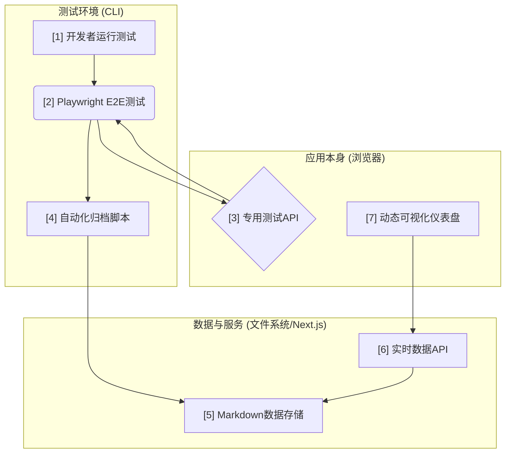

# 构建全自动"测试-分析-洞察"闭环工作流：一份可复用的实战指南

---

## 目录
- [1. 愿景：从被动测试到主动洞察](#1-愿景从被动测试到主动洞察)
- [2. 架构总览：自动化流程的七个关键节点](#2-架构总览自动化流程的七个关键节点)
- [3. 核心组件深度解析](#3-核心组件深度解析)
  - [3.1 基石：用"专用测试API"根除不稳定性](#31-基石用专用测试api根除不稳定性)
  - [3.2 桥梁：自动化数据收集与归档](#32-桥梁自动化数据收集与归档)
  - [3.3 洞察：实时API与动态可视化](#33-洞察实时api与动态可视化)
- [4. 自动化测试体系的落地实践](#4-自动化测试体系的落地实践)
- [5. 临时专项测试的隔离与管理](#5-临时专项测试的隔离与管理)
- [6. 跨设备兼容性与高性能环境下的稳健性实践](#6-跨设备兼容性与高性能环境下的稳健性实践)
  - [6.1 统一基础配置，兼容多端执行](#61-统一基础配置兼容多端执行)
  - [6.2 针对高性能设备的特殊优化](#62-针对高性能设备的特殊优化)
  - [6.3 CI与本地环境差异应对](#63-ci与本地环境差异应对)
  - [6.4 迁移与排查流程建议](#64-迁移与排查流程建议)
- [7. 实战案例：以"生成式拼图"项目为例](#7-实战案例以生成式拼图项目为例)
- [8. Playwright最佳实践与配置模板](#8-playwright最佳实践与配置模板)
  - [8.1 推荐配置模板（playwright.config.ts）](#81-推荐配置模板playwrightconfigts)
  - [8.2 测试用例内等待竞态数据的推荐写法](#82-测试用例内等待竞态数据的推荐写法)
  - [8.3 常用调试命令](#83-常用调试命令)
  - [8.4 依赖与类型检查建议](#84-依赖与类型检查建议)
  - [8.5 其他建议](#85-其他建议)
  - [8.6 可视化分析平台与趋势洞察](#86-可视化分析平台与趋势洞察)
- [FAQ：常见问题解答](#faq常见问题解答)
- [Checklist：自动化测试体系落地自查清单](#checklist自动化测试体系落地自查清单)

---

## 1. 愿景：从被动测试到主动洞察

在现代Web应用开发中，我们常常面临以下挑战：
- **脆弱的测试**：端到端（E2E）测试因依赖复杂的UI交互而频繁失败，导致"狼来了"效应，没人再相信失败的测试。
- **孤立的数据**：性能数据（加载时间、FPS、内存等）要么仅存在于单次测试的日志中，要么需要手动收集和整理，无法形成趋势。
- **滞后的反馈**：从发现性能退步到定位问题，往往需要漫长的手动排查，反馈周期极长。

本项目旨在解决这些痛点。我们为"生成式拼图"游戏构建了一套全自动的闭环工作流，它将**测试执行、数据分析和趋势洞察**无缝地连接起来，实现了从代码提交到性能看板更新的零人工干预。

本文档将详细拆解此工作流的架构与实现，希望能为你的项目提供一份可复用的实战指南。

## 2. 架构总览：自动化流程的七个关键节点

我们的工作流由七个核心组件构成，它们像齿轮一样紧密啮合，驱动着整个自动化流程：



1.  **开发者运行测试**：一切的起点，一个简单的 `npm run test:e2e` 命令。
2.  **Playwright E2E测试**：执行自动化测试，但它不直接与UI交互。
3.  **专用测试API**：**架构的基石**。我们在应用内部暴露的一组函数，供测试脚本直接调用，以程序化方式驱动应用状态。
4.  **自动化归档脚本**：测试结束后自动运行的Node.js脚本，负责从测试结果中提取数据并格式化。
5.  **Markdown数据存储**：所有测试报告都以"JSON Front-matter + Markdown"的格式存储在 `playwright-test-logs/` 目录下，既人类可读，也易于解析。
6.  **实时数据API**：一个Next.js API路由，它不依赖数据库，而是在被请求时实时扫描并解析所有Markdown报告。
7.  **动态可视化仪表盘**：一个React页面，通过调用实时数据API来展示性能趋势图表和详细的报告列表。

## 3. 核心组件深度解析

### 3.1. 基石：用"专用测试API"根除不稳定性

这是我们能实现100%稳定性的核心秘诀。

-   **问题所在**：`page.click()`、`page.dragTo()` 等UI模拟操作天生脆弱，它们极易受到React（或任何现代框架）异步渲染、动画延迟、DOM结构变化等因素的干扰，导致竞态条件和随机失败。
-   **我们的方案：从"模拟用户"到"驱动应用"**：我们不再尝试像用户一样去"点击"按钮，而是直接调用按钮背后的那个函数。为此，我们在`GameContext.tsx`中创建了一组专供测试环境使用的函数，并把它们挂载到`window`对象上。

    ```tsx
    // In GameContext.tsx
    useEffect(() => {
      if (process.env.NODE_ENV === 'development') {
        window.testAPI = {
          selectPieceForTest: (id) => dispatch({ type: 'SELECT_PIECE', payload: id }),
          rotatePieceForTest: () => dispatch({ type: 'ROTATE_PIECE' }),
          // ... more functions
        };
      }
    }, [dispatch]);
    ```

-   **测试脚本的重构**：有了这个API后，测试脚本变得极其简单和稳定。

    ```typescript
    // In e2e/full_game_flow.spec.ts

    // 旧的、不稳定的方式
    // await page.locator('#piece-5').dragTo('#target-5');
    // await page.getByRole('button', { name: '旋转' }).click();

    // 新的、100%可靠的方式
    await page.evaluate(() => window.testAPI.selectPieceForTest(5));
    await page.evaluate(() => window.testAPI.rotatePieceForTest());
    ```

### 3.2. 桥梁：自动化数据收集与归档

-   **在测试中附加数据**：Playwright允许在测试运行时附加任意信息。我们在测试的最后，将收集到的所有性能指标作为一个JSON字符串附加到测试结果上。

    ```typescript
    // In e2e/full_game_flow.spec.ts
    test.afterEach(async ({ page }, testInfo) => {
      // ...
      const performanceData = await page.evaluate(() => window.getPerformanceMetrics());
      const buffer = Buffer.from(JSON.stringify(performanceData, null, 2));
      await testInfo.attach('performance-metrics', { body: buffer, contentType: 'application/json' });
    });
    ```

-   **解析与归档脚本 (`scripts/archive-test-results.js`)**：
    1.  在`package.json`中，我们使用 `&&` 将测试和归档命令串联起来：`"test:e2e": "playwright test && node scripts/archive-test-results.js"`。
    2.  此脚本读取Playwright输出的`test-results.json`。
    3.  它遍历所有测试结果，找到我们附加的`performance-metrics`。
    4.  **关键一步**：附件内容是Base64编码的，需要先解码再解析JSON：`JSON.parse(Buffer.from(attachment.body, 'base64').toString())`。
    5.  最后，将所有数据整理成一个包含JSON元数据的Markdown文件，写入文件系统。

### 3.3. 洞察：实时API与动态可视化

-   **零数据库的实时API (`/api/performance-trend/route.ts`)**：
    -   这是一个标准的Next.js API路由（或任何后端的等价物）。
    -   它使用Node.js的`fs`模块读取`playwright-test-logs`目录下的所有`.md`文件名。
    -   对每个文件，它只读取文件头部包含`<!--`和`-->`的JSON块，进行解析。
    -   将所有解析后的JSON对象聚合成一个数组返回。
    -   **优点**：极度轻量，无需维护数据库，数据永远和文件系统同步。

-   **动态仪表盘 (`/app/test/page.tsx`)**：
    -   一个纯粹的前端页面，其唯一的数据源就是上述API。
    -   使用`useEffect`钩子在页面加载时`fetch('/api/performance-trend')`。
    -   使用`recharts`等图表库将获取到的数据渲染成趋势图。
    -   使用表格组件和分页逻辑展示详细的报告列表。

## 4. 自动化测试体系的落地实践

本章总结如何将上述架构和核心组件应用到你的项目中，形成可持续演进的自动化测试体系。

1.  **识别痛点**：找到你项目中那些最不稳定、最常无故失败的E2E测试。
2.  **设计你的测试API**：思考要绕过这些UI交互，你需要应用内部提供哪些"后门"函数？（如`loginUser()`, `addProductToCart()`）。
3.  **实现并暴露API**：在你的应用代码中实现这些函数，并通过`window`对象暴露它们（记得用环境变量匡定范围）。
4.  **重构测试脚本**：用`page.evaluate()`调用你的新API，替换掉旧的UI模拟代码。
5.  **建立数据管道**：仿照3.2和3.3的思路，建立从测试结果到可视化前端的数据收集、归档和展示流程。

通过这套流程，你也能将项目的测试体系从一个脆弱的"成本中心"，转变为一个稳定、可靠、能持续产生价值的"洞察中心"。 

## 5. 临时专项测试的隔离与管理

在自动化测试开发过程中，常常需要为新特性验证、bug复现、调试等目的，临时编写专项测试脚本。为避免这些临时脚本影响主干全流程回归测试，本项目采用如下隔离机制：

- **配置隔离**：在`playwright.config.ts`中通过`testIgnore: ['temp/**']`，自动忽略`e2e/temp/`目录下的所有测试脚本。主流程回归测试（如`npx playwright test`）不会执行这些临时脚本。
- **目录约定**：所有临时、专项、调试用的Playwright脚本请统一放置在`e2e/temp/`目录下，便于管理和后续清理。
- **独立运行**：如需单独运行某个专项脚本，可直接指定路径：
  ```bash
  npx playwright test e2e/temp/your_temp_test.spec.ts
  ```
  这样不会影响主流程测试结果和报告。
- **适用场景**：
  - 新特性/新页面的自动化验证
  - 线上/历史bug的复现与定位
  - 复杂交互的调试与断点分析
  - 个人开发阶段的实验性脚本
- **团队协作建议**：
  - 临时脚本请用有意义的命名（如`bug-xxx-repro.spec.ts`、`feature-yyy-demo.spec.ts`）
  - 定期review和清理`e2e/temp/`目录，避免遗留无用脚本
  - 重要的专项脚本可沉淀到主流程或文档，临时脚本建议不纳入回归

> ⚠️ 注意：
> - `testIgnore: ['temp/**']` 开启时，主流程不会执行 temp 目录下脚本。
> - 如需批量运行 temp 下脚本，请临时注释掉该配置。
> - 单独运行 temp 下脚本（如 `npx playwright test e2e/temp/xxx.spec.ts`）不受影响。
> - 推荐日常主流程开启 testIgnore，专项/调试时可灵活调整。

本章小结：通过隔离与规范管理临时专项测试，既保障了主流程的纯净稳定，也提升了团队协作与调试效率。

## 6. 跨设备兼容性与高性能环境下的稳健性实践

随着自动化测试体系的成熟，跨设备、跨环境的兼容性和稳健性尤为重要。本章沉淀了在不同硬件（如高性能Mac、老旧PC、CI服务器等）和操作系统环境下的最佳实践，帮助团队应对迁移、升级、CI集成等多种场景。

### 6.1 统一基础配置，兼容多端执行
- **锁定Playwright版本**：在`package.json`中指定Playwright依赖的精确版本，避免因本地/CI环境差异导致的兼容性问题。
- **仅安装所需浏览器**：如只需Chromium，可用`npx playwright install chromium --with-deps`节省CI空间与时间。
- **配置retries与timeout**：在`playwright.config.ts`中合理设置`retries`（如1-2次）和全局`timeout`，兜底偶发性失败。
- **trace与reporter**：保持`trace: 'on'`或`'retain-on-failure'`，并启用HTML报告，便于跨端溯源。

### 6.2 针对高性能设备的特殊优化
- **等待异步状态**：高性能设备上Playwright执行速度远超React等前端异步渲染，极易出现"状态未就绪即断言/操作"导致的flaky。务必用`waitForFunction`等方式等待window对象/关键数据结构（如`window.__gameStateForTests__`、`puzzle`数组等）完全就绪。
- **提升等待超时阈值**：如遇偶发超时，将`waitForFunction`等等待的超时时间提升至20-30秒。
- **自动重试机制**：在脚本层面对关键步骤失败时自动重试一次，配合Playwright的`retries`机制，最大化稳定性。

### 6.3 CI与本地环境差异应对
- **环境变量隔离**：用`process.env.NODE_ENV`等变量区分本地/CI/生产，确保测试API等"后门"仅在安全环境暴露。
- **软断言与web-first assertions**：多用Playwright的`expect.soft`和web-first断言，减少因偶发渲染延迟导致的误报。
- **UI/Debug模式调试**：用`npx playwright test --ui`或`--debug`在本地复现极端偶发问题，配合Trace Viewer分析window状态。

### 6.4 迁移与排查流程建议
- **迁移前先本地全量跑通**，再在新设备/CI上逐步调优。
- **遇到flaky优先排查异步竞态**，其次排查依赖、环境变量、端口等外部因素。
- **善用Trace Viewer和HTML报告**，定位失败时的window/DOM/网络状态。
- **经验沉淀**：将每次迁移、排查、修复的关键点记录在项目文档，形成团队知识库。

本章小结：通过配置、等待、调试等多维度优化，显著提升了自动化测试体系在多端环境下的稳定性和可迁移性。

## 7. 实战案例：以"生成式拼图"项目为例

本章以实际项目为例，具体展示上述流程和机制的落地细节，帮助你更好地理解和迁移到自己的业务场景。

### 第一步：识别痛点——不精确的拖拽与竞态点击

我们的核心测试场景是"完成一局完整的拼图"。在最初的版本中，我们使用了`page.dragTo()`来模拟用户拖拽拼图。这导致了两个问题：
1.  **定位不准**：拼图需要被精确放置才能触发"吸附"效果，而`dragTo`的落点有像素级偏差，导致测试频繁因拼图未吸附而超时失败。
2.  **竞态条件**：在修复拖拽后，我们尝试用`page.click()`点击"旋转"按钮，但由于React的渲染是异步的，测试脚本的点击速度超过了按钮的"启用"速度，导致点击被画布捕获，意外取消了拼图选中。

### 第二步：设计并实现我们的"游戏测试API"

我们意识到修补UI模拟是徒劳的。因此，我们决定为游戏的核心状态管理中心`contexts/GameContext.tsx`添加一套程序化接口。

```tsx
// file: contexts/GameContext.tsx

// ...
  useEffect(() => {
    // 仅在开发和测试环境下暴露API
    if (process.env.NODE_ENV === 'development') {
      window.testAPI = {
        // 直接派发action来修改状态，绕开UI交互
        selectPieceForTest: (id: number) => dispatch({ type: 'SELECT_PIECE', payload: id }),
        rotatePieceForTest: () => dispatch({ type: 'ROTATE_PIECE' }),
        markPieceAsCompletedForTest: (piece: PuzzlePiece) => {
          dispatch({ type: 'ADD_COMPLETED_PIECE', payload: piece });
        },
        resetPiecePositionForTest: (pieceId: number) => {
          dispatch({ type: 'RESET_PIECE_POSITION', payload: pieceId });
        },
        // ... 其他辅助函数
      };
    }
  }, [dispatch]);
// ...
```

### 第三步：使用API重构测试脚本

我们将`e2e/full_game_flow.spec.ts`中的不稳定操作全部替换为API调用。

```typescript
// file: e2e/full_game_flow.spec.ts

// ...
for (const piece of piecesToSolve) {
  // --- 旧方法 (脆弱) ---
  // const pieceElement = page.locator(`[data-piece-id="${piece.id}"]`);
  // await pieceElement.dragTo(piece.targetPosition); // 不精确
  // await page.getByRole('button', { name: '旋转' }).click(); // 竞态条件

  // --- 新方法 (稳定) ---
  // 1. 选中
  await page.evaluate((id) => window.testAPI.selectPieceForTest(id), piece.id);
  // 2. 旋转 (如果需要)
  // ...
  // 3. 直接将其移动到最终位置
  await page.evaluate((id) => window.testAPI.resetPiecePositionForTest(id), piece.id);
  // 4. 标记为完成
  await page.evaluate((p) => window.testAPI.markPieceAsCompletedForTest(p), piece);
}
// ...
```

### 第四步：搭建自动化数据管道

1.  **注入`test:e2e`命令**：在`package.json`中，我们将归档脚本连接到测试命令之后。

    ```json
    // file: package.json
    "scripts": {
      "test:e2e": "playwright test && node scripts/archive-test-results.js"
    },
    ```

2.  **归档脚本 (`archive-test-results.js`)**：此脚本的核心是从Playwright的测试结果中读取我们附加的性能数据，并创建Markdown报告。

    ```javascript
    // file: scripts/archive-test-results.js
    // ...
    const results = JSON.parse(fs.readFileSync('test-results/test-results.json', 'utf-8'));
    for (const result of results.suites[0].specs) {
        const testCase = result.tests[0];
        const attachment = testCase.results[0].attachments.find(a => a.name === 'performance-metrics');
        if (attachment) {
            // 解码并解析性能数据
            const metrics = JSON.parse(Buffer.from(attachment.body, 'base64').toString());
            
            // ... 根据数据生成Markdown内容 ...

            // 写入文件
            fs.writeFileSync(reportPath, markdownContent);
        }
    }
    // ...
    ```
3.  **实时API (`api/performance-trend/route.ts`)**：这个API负责在被请求时，动态地从文件系统读取所有报告的元数据。

    ```typescript
    // file: app/api/performance-trend/route.ts
    import fs from 'fs';
    import path from 'path';
    
    export async function GET() {
        const logDir = path.join(process.cwd(), 'playwright-test-logs');
        const files = fs.readdirSync(logDir).filter(f => f.endsWith('.md'));
        
        const trendData = files.map(file => {
            const content = fs.readFileSync(path.join(logDir, file), 'utf-8');
            const match = content.match(/<!--\s*(\{[\s\S]*?\})\s*-->/);
            if (match && match[1]) {
                return JSON.parse(match[1]).data;
            }
            return null;
        }).filter(Boolean);

        return new Response(JSON.stringify(trendData.reverse()));
    }
    ```
这样，一个从测试执行到数据洞察的全自动化闭环就完整地建立起来了。

## 8. Playwright最佳实践与配置模板

本节补充自动化测试体系在实际落地中，Playwright相关的最佳实践与推荐配置，帮助团队进一步提升E2E测试的稳定性、可维护性与调试效率。

### 8.1 推荐配置模板（playwright.config.ts）

```ts
import { defineConfig, devices } from '@playwright/test';

export default defineConfig({
  // 1. 提高全局超时，适应高性能环境下的异步竞态
  timeout: 60 * 1000, // 单个测试最大60秒

  // 2. 测试目录
  testDir: './e2e',

  // 3. 自动重试失败用例，提升稳定性
  retries: 1,

  // 4. 并发worker数（可根据CPU调整）
  workers: 2,

  // 5. 只安装需要的浏览器，节省CI资源
  // npx playwright install chromium --with-deps

  // 6. 追踪配置，便于本地和CI调试
  use: {
    headless: true, // CI建议true，本地可false
    viewport: { width: 1280, height: 800 },
    ignoreHTTPSErrors: true,
    video: 'retain-on-failure', // 失败时保留视频
    screenshot: 'only-on-failure',
    trace: 'on-first-retry', // 只在重试时开启trace，避免性能损耗
    baseURL: 'http://localhost:3000', // 按需修改
  },

  // 7. 多浏览器配置（如需全兼容性测试）
  projects: [
    {
      name: 'chromium',
      use: { ...devices['Desktop Chrome'] },
    },
    // 如需firefox/webkit可解注释
    // {
    //   name: 'firefox',
    //   use: { ...devices['Desktop Firefox'] },
    // },
    // {
    //   name: 'webkit',
    //   use: { ...devices['Desktop Safari'] },
    // },
  ],

  // 8. 本地服务自动启动（如需）
  webServer: {
    command: 'npm run dev', // 或'yarn dev'
    port: 3000,
    timeout: 120 * 1000,
    reuseExistingServer: !process.env.CI,
  },
});
```

---

### 8.2 测试用例内等待竞态数据的推荐写法

```ts
// 等待核心数据数组准备好，超时30秒
await page.waitForFunction(() => {
  const state = (window as any).__gameStateForTests__;
  return (
    state &&
    Array.isArray(state.puzzle) && state.puzzle.length > 0 &&
    Array.isArray(state.originalPositions) && state.originalPositions.length > 0
  );
}, { timeout: 30000 });
```

---

### 8.3 常用调试命令

```bash
# UI模式，便于断点和可视化调试
npx playwright test --ui

# Trace调试，生成详细trace
npx playwright test --trace on

# 查看HTML报告
npx playwright show-report

# 指定单个测试文件并debug
npx playwright test e2e/full_game_flow.spec.ts --debug
```

---

### 8.4 依赖与类型检查建议

- 保持Playwright及相关依赖为最新版本：
  ```bash
  npm install -D @playwright/test@latest
  npx playwright install --with-deps
  ```
- TypeScript项目建议加类型检查：
  ```bash
  npx tsc --noEmit
  ```
- ESLint建议开启`@typescript-eslint/no-floating-promises`，防止漏写`await`。

---

### 8.5 其他建议

- CI环境建议只安装需要的浏览器：  
  `npx playwright install chromium --with-deps`
- 多用web-first assertions和软断言（`expect.soft`），提升测试健壮性。
- 临时/专项测试建议放在`e2e/temp/`目录，并用`testIgnore`隔离。
- 每次迁移、升级、排查后，及时补充FAQ和Checklist，形成团队知识库。

---

### 8.6 可视化分析平台与趋势洞察

本平台基于自动归档的Markdown报告、API聚合与React可视化，支持：

- 测试执行统计与成功率追踪
- 性能指标趋势与基准线对比
- 详细历史报告与失败溯源
- 自动性能建议与优化指引

#### 8.6.1 平台架构与数据流

- **数据归档**：所有测试报告以 Markdown+JSON Front-matter 归档于 `playwright-test-logs/`，由归档脚本自动生成，字段结构标准化。
- **API聚合**：`/api/performance-trend/route.ts` 动态扫描所有报告，抽取核心指标，聚合为趋势数据，保证字段类型一致、健壮。
- **前端可视化**：`/app/test/page.tsx` 通过 Recharts 等组件，展示统计卡片、趋势折线图、详细表格和性能建议，支持分页、指标切换、失败详情跳转。

#### 8.6.2 主要功能与指标

- **执行统计**：总运行次数、成功/失败次数、成功率。
- **性能合规分析**：所有核心指标（加载、生成、交互、FPS、内存）合规/预警/超标分布。
- **趋势图**：各项性能指标随时间的变化，含基准线，超标点高亮。
- **详细报告表**：每次测试的所有原始数据、状态、场景参数，失败用例可跳转详细报告。
- **性能建议**：自动根据超标项给出针对性优化建议。

#### 8.6.3 设计与实现要点

- **数据结构标准化**：所有报告的 JSON 元数据字段需保持一致，便于聚合和前端渲染。
- **API健壮性**：API需处理异常、缺失数据，保证前端不因单个报告异常而崩溃。
- **前端交互**：支持趋势高亮、表格联动、失败详情跳转、性能建议动态展示等功能。
- **基准线可配置**：建议将基准值抽离为常量，便于后续动态调整。

#### 8.6.4 持续优化建议

- 支持多维度对比（如版本、设备、场景）
- 支持一键导出报告
- 支持失败用例自动截图与溯源
- 趋势图与表格联动，便于溯源
- 性能建议与超标项联动，仅在有超标时高亮显示

---

本节内容可结合第6章"跨设备兼容性与高性能环境下的稳健性实践"一同参考，助力你的自动化测试体系更高效、更稳健、更易维护。

---

## FAQ：常见问题解答

**Q1：项目迁移到新设备或CI后，E2E测试频繁flaky，如何排查？**
- 检查Playwright及依赖版本是否一致。
- 检查`playwright.config.ts`中的`timeout`、`retries`、`trace`等配置。
- 用`waitForFunction`/web-first assertions确保异步状态就绪。
- 用Trace Viewer分析失败时window/DOM状态。

**Q2：如何只安装所需浏览器，节省CI资源？**
- 运行`npx playwright install chromium --with-deps`，只下载Chromium。

**Q3：高性能设备下测试比开发机更容易失败，为什么？**
- 设备越快，Playwright脚本执行速度越快，前端异步渲染未完成时就发起断言/操作，导致竞态。需提升等待阈值并用更稳健的等待逻辑。

**Q4：如何让测试API只在安全环境暴露？**
- 用`process.env.NODE_ENV`判断，仅在`development`或`test`环境下挂载到window。

**Q5：如何快速定位偶发失败的根因？**
- 保持`trace: 'on'`，用Trace Viewer和HTML报告还原失败现场。
- 本地用`npx playwright test --ui`或`--debug`复现。

**Q6：如何让团队成员持续沉淀经验？**
- 每次迁移、排查、修复后，补充到本FAQ或Checklist，形成团队知识库。

---

## Checklist：自动化测试体系落地自查清单

- [ ] Playwright及相关依赖版本已锁定，团队/CI环境一致
- [ ] 仅安装所需浏览器，避免冗余下载
- [ ] `playwright.config.ts`已配置合理的`timeout`、`retries`、`trace`、reporter
- [ ] 关键异步状态均有稳健的等待/断言逻辑，避免竞态
- [ ] 测试API仅在安全环境暴露，未泄漏到生产
- [ ] 测试数据、性能指标已自动归档，便于趋势分析
- [ ] 兼容性、迁移、排查等经验已沉淀到FAQ/文档
- [ ] 新成员可通过目录、FAQ、案例快速上手
- [ ] 每次迁移/升级/排查后，团队有机制补充知识库

---