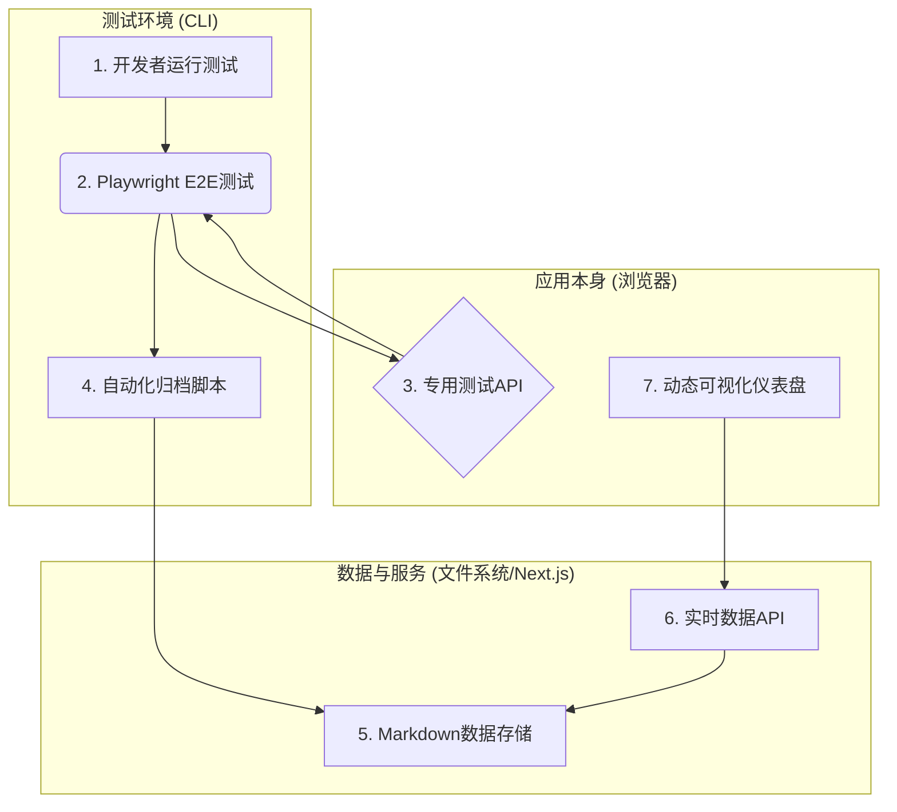

# 构建全自动"测试-分析-洞察"闭环工作流：一份可复用的实战指南

## 1. 愿景：从被动测试到主动洞察

在现代Web应用开发中，我们常常面临以下挑战：
- **脆弱的测试**：端到端（E2E）测试因依赖复杂的UI交互而频繁失败，导致"狼来了"效应，没人再相信失败的测试。
- **孤立的数据**：性能数据（加载时间、FPS、内存等）要么仅存在于单次测试的日志中，要么需要手动收集和整理，无法形成趋势。
- **滞后的反馈**：从发现性能退步到定位问题，往往需要漫长的手动排查，反馈周期极长。

本项目旨在解决这些痛点。我们为"生成式拼图"游戏构建了一套全自动的闭环工作流，它将**测试执行、数据分析和趋势洞察**无缝地连接起来，实现了从代码提交到性能看板更新的零人工干预。

本文档将详细拆解此工作流的架构与实现，希望能为你的项目提供一份可复用的实战指南。

## 2. 架构总览：自动化流程的七个关键节点

我们的工作流由七个核心组件构成，它们像齿轮一样紧密啮合，驱动着整个自动化流程：



1.  **开发者运行测试**：一切的起点，一个简单的 `npm run test:e2e` 命令。
2.  **Playwright E2E测试**：执行自动化测试，但它不直接与UI交互。
3.  **专用测试API**：**架构的基石**。我们在应用内部暴露的一组函数，供测试脚本直接调用，以程序化方式驱动应用状态。
4.  **自动化归档脚本**：测试结束后自动运行的Node.js脚本，负责从测试结果中提取数据并格式化。
5.  **Markdown数据存储**：所有测试报告都以"JSON Front-matter + Markdown"的格式存储在 `playwright-test-logs/` 目录下，既人类可读，也易于解析。
6.  **实时数据API**：一个Next.js API路由，它不依赖数据库，而是在被请求时实时扫描并解析所有Markdown报告。
7.  **动态可视化仪表盘**：一个React页面，通过调用实时数据API来展示性能趋势图表和详细的报告列表。

## 3. 核心组件深度解析

### 3.1. 基石：用"专用测试API"根除不稳定性

这是我们能实现100%稳定性的核心秘诀。

-   **问题所在**：`page.click()`、`page.dragTo()` 等UI模拟操作天生脆弱，它们极易受到React（或任何现代框架）异步渲染、动画延迟、DOM结构变化等因素的干扰，导致竞态条件和随机失败。
-   **我们的方案：从"模拟用户"到"驱动应用"**：我们不再尝试像用户一样去"点击"按钮，而是直接调用按钮背后的那个函数。为此，我们在`GameContext.tsx`中创建了一组专供测试环境使用的函数，并把它们挂载到`window`对象上。

    ```tsx
    // In GameContext.tsx
    useEffect(() => {
      if (process.env.NODE_ENV === 'development') {
        window.testAPI = {
          selectPieceForTest: (id) => dispatch({ type: 'SELECT_PIECE', payload: id }),
          rotatePieceForTest: () => dispatch({ type: 'ROTATE_PIECE' }),
          // ... more functions
        };
      }
    }, [dispatch]);
    ```

-   **测试脚本的重构**：有了这个API后，测试脚本变得极其简单和稳定。

    ```typescript
    // In e2e/full_game_flow.spec.ts

    // 旧的、不稳定的方式
    // await page.locator('#piece-5').dragTo('#target-5');
    // await page.getByRole('button', { name: '旋转' }).click();

    // 新的、100%可靠的方式
    await page.evaluate(() => window.testAPI.selectPieceForTest(5));
    await page.evaluate(() => window.testAPI.rotatePieceForTest());
    ```

### 3.2. 桥梁：自动化数据收集与归档

-   **在测试中附加数据**：Playwright允许在测试运行时附加任意信息。我们在测试的最后，将收集到的所有性能指标作为一个JSON字符串附加到测试结果上。

    ```typescript
    // In e2e/full_game_flow.spec.ts
    test.afterEach(async ({ page }, testInfo) => {
      // ...
      const performanceData = await page.evaluate(() => window.getPerformanceMetrics());
      const buffer = Buffer.from(JSON.stringify(performanceData, null, 2));
      await testInfo.attach('performance-metrics', { body: buffer, contentType: 'application/json' });
    });
    ```

-   **解析与归档脚本 (`scripts/archive-test-results.js`)**：
    1.  在`package.json`中，我们使用 `&&` 将测试和归档命令串联起来：`"test:e2e": "playwright test && node scripts/archive-test-results.js"`。
    2.  此脚本读取Playwright输出的`test-results.json`。
    3.  它遍历所有测试结果，找到我们附加的`performance-metrics`。
    4.  **关键一步**：附件内容是Base64编码的，需要先解码再解析JSON：`JSON.parse(Buffer.from(attachment.body, 'base64').toString())`。
    5.  最后，将所有数据整理成一个包含JSON元数据的Markdown文件，写入文件系统。

### 3.3. 洞察：实时API与动态可视化

-   **零数据库的实时API (`/api/performance-trend/route.ts`)**：
    -   这是一个标准的Next.js API路由（或任何后端的等价物）。
    -   它使用Node.js的`fs`模块读取`playwright-test-logs`目录下的所有`.md`文件名。
    -   对每个文件，它只读取文件头部包含`<!--`和`-->`的JSON块，进行解析。
    -   将所有解析后的JSON对象聚合成一个数组返回。
    -   **优点**：极度轻量，无需维护数据库，数据永远和文件系统同步。

-   **动态仪表盘 (`/app/test/page.tsx`)**：
    -   一个纯粹的前端页面，其唯一的数据源就是上述API。
    -   使用`useEffect`钩子在页面加载时`fetch('/api/performance-trend')`。
    -   使用`recharts`等图表库将获取到的数据渲染成趋势图。
    -   使用表格组件和分页逻辑展示详细的报告列表。

## 4. 如何在你的项目中实践？

1.  **识别痛点**：找到你项目中那些最不稳定、最常无故失败的E2E测试。
2.  **设计你的测试API**：思考要绕过这些UI交互，你需要应用内部提供哪些"后门"函数？（如`loginUser()`, `addProductToCart()`）。
3.  **实现并暴露API**：在你的应用代码中实现这些函数，并通过`window`对象暴露它们（记得用环境变量匡定范围）。
4.  **重构测试脚本**：用`page.evaluate()`调用你的新API，替换掉旧的UI模拟代码。
5.  **建立数据管道**：仿照3.2和3.3的思路，建立从测试结果到可视化前端的数据收集、归档和展示流程。

通过这套流程，你也能将项目的测试体系从一个脆弱的"成本中心"，转变为一个稳定、可靠、能持续产生价值的"洞察中心"。 

## 5. 实战案例：以“生成式拼图”项目为例

下面，我们将以本项目为例，具体展示上述流程是如何落地的。

### 第一步：识别痛点——不精确的拖拽与竞态点击

我们的核心测试场景是“完成一局完整的拼图”。在最初的版本中，我们使用了`page.dragTo()`来模拟用户拖拽拼图。这导致了两个问题：
1.  **定位不准**：拼图需要被精确放置才能触发“吸附”效果，而`dragTo`的落点有像素级偏差，导致测试频繁因拼图未吸附而超时失败。
2.  **竞态条件**：在修复拖拽后，我们尝试用`page.click()`点击“旋转”按钮，但由于React的渲染是异步的，测试脚本的点击速度超过了按钮的“启用”速度，导致点击被画布捕获，意外取消了拼图选中。

### 第二步：设计并实现我们的“游戏测试API”

我们意识到修补UI模拟是徒劳的。因此，我们决定为游戏的核心状态管理中心`contexts/GameContext.tsx`添加一套程序化接口。

```tsx
// file: contexts/GameContext.tsx

// ...
  useEffect(() => {
    // 仅在开发和测试环境下暴露API
    if (process.env.NODE_ENV === 'development') {
      window.testAPI = {
        // 直接派发action来修改状态，绕开UI交互
        selectPieceForTest: (id: number) => dispatch({ type: 'SELECT_PIECE', payload: id }),
        rotatePieceForTest: () => dispatch({ type: 'ROTATE_PIECE' }),
        markPieceAsCompletedForTest: (piece: PuzzlePiece) => {
          dispatch({ type: 'ADD_COMPLETED_PIECE', payload: piece });
        },
        resetPiecePositionForTest: (pieceId: number) => {
          dispatch({ type: 'RESET_PIECE_POSITION', payload: pieceId });
        },
        // ... 其他辅助函数
      };
    }
  }, [dispatch]);
// ...
```

### 第三步：使用API重构测试脚本

我们将`e2e/full_game_flow.spec.ts`中的不稳定操作全部替换为API调用。

```typescript
// file: e2e/full_game_flow.spec.ts

// ...
for (const piece of piecesToSolve) {
  // --- 旧方法 (脆弱) ---
  // const pieceElement = page.locator(`[data-piece-id="${piece.id}"]`);
  // await pieceElement.dragTo(piece.targetPosition); // 不精确
  // await page.getByRole('button', { name: '旋转' }).click(); // 竞态条件

  // --- 新方法 (稳定) ---
  // 1. 选中
  await page.evaluate((id) => window.testAPI.selectPieceForTest(id), piece.id);
  // 2. 旋转 (如果需要)
  // ...
  // 3. 直接将其移动到最终位置
  await page.evaluate((id) => window.testAPI.resetPiecePositionForTest(id), piece.id);
  // 4. 标记为完成
  await page.evaluate((p) => window.testAPI.markPieceAsCompletedForTest(p), piece);
}
// ...
```

### 第四步：搭建自动化数据管道

1.  **注入`test:e2e`命令**：在`package.json`中，我们将归档脚本连接到测试命令之后。

    ```json
    // file: package.json
    "scripts": {
      "test:e2e": "playwright test && node scripts/archive-test-results.js"
    },
    ```

2.  **归档脚本 (`archive-test-results.js`)**：此脚本的核心是从Playwright的测试结果中读取我们附加的性能数据，并创建Markdown报告。

    ```javascript
    // file: scripts/archive-test-results.js
    // ...
    const results = JSON.parse(fs.readFileSync('test-results/test-results.json', 'utf-8'));
    for (const result of results.suites[0].specs) {
        const testCase = result.tests[0];
        const attachment = testCase.results[0].attachments.find(a => a.name === 'performance-metrics');
        if (attachment) {
            // 解码并解析性能数据
            const metrics = JSON.parse(Buffer.from(attachment.body, 'base64').toString());
            
            // ... 根据数据生成Markdown内容 ...

            // 写入文件
            fs.writeFileSync(reportPath, markdownContent);
        }
    }
    // ...
    ```
3.  **实时API (`api/performance-trend/route.ts`)**：这个API负责在被请求时，动态地从文件系统读取所有报告的元数据。

    ```typescript
    // file: app/api/performance-trend/route.ts
    import fs from 'fs';
    import path from 'path';
    
    export async function GET() {
        const logDir = path.join(process.cwd(), 'playwright-test-logs');
        const files = fs.readdirSync(logDir).filter(f => f.endsWith('.md'));
        
        const trendData = files.map(file => {
            const content = fs.readFileSync(path.join(logDir, file), 'utf-8');
            const match = content.match(/<!--\s*(\{[\s\S]*?\})\s*-->/);
            if (match && match[1]) {
                return JSON.parse(match[1]).data;
            }
            return null;
        }).filter(Boolean);

        return new Response(JSON.stringify(trendData.reverse()));
    }
    ```
这样，一个从测试执行到数据洞察的全自动化闭环就完整地建立起来了。