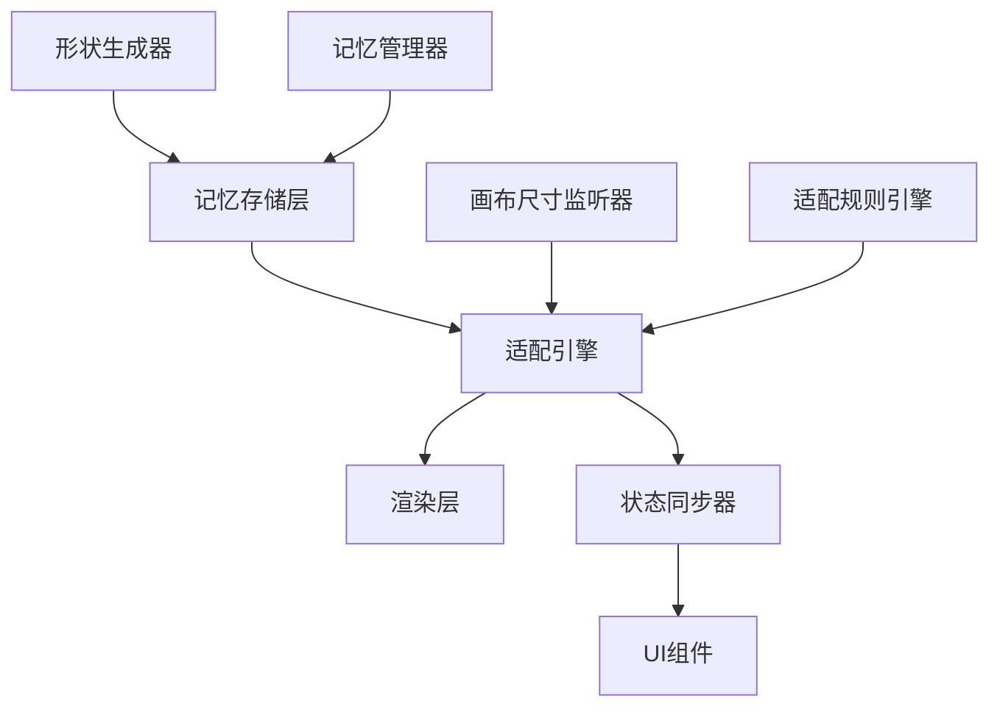
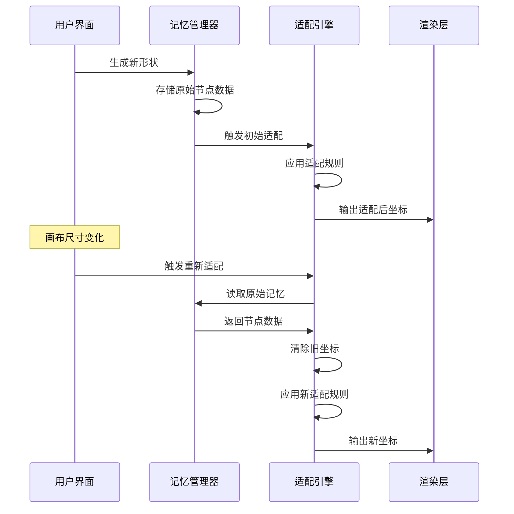

# 拼图记忆适配系统设计文档

## 概述

拼图记忆适配系统将形状存储、记忆管理和动态适配整合为一个统一的架构。系统的核心理念是将形状的"记忆"（原始拓扑结构）与"表现"（当前坐标和尺寸）分离，通过适配引擎在不同画布尺寸间进行转换。

## 架构

### 核心组件



### 数据流



## 组件设计

### 1. 记忆存储层 (MemoryStorage)

**职责:** 管理形状的原始数据存储和检索

```typescript
interface ShapeMemory {
  id: string;
  topology: ShapeTopology;
  baseCanvasSize: CanvasSize;
  metadata: ShapeMetadata;
  timestamp: number;
}

interface ShapeTopology {
  nodes: TopologyNode[];
  relationships: NodeRelationship[];
  boundingInfo: BoundingInfo;
}

class MemoryStorage {
  private memories: Map<string, ShapeMemory> = new Map();
  
  store(shapeId: string, topology: ShapeTopology, baseCanvas: CanvasSize): void
  retrieve(shapeId: string): ShapeMemory | null
  clear(shapeId: string): void
  listAll(): ShapeMemory[]
}
```

### 2. 适配引擎 (AdaptationEngine)

**职责:** 执行记忆读取、坐标清除和重新适配的核心逻辑

```typescript
interface AdaptationContext {
  sourceCanvas: CanvasSize;
  targetCanvas: CanvasSize;
  adaptationRules: AdaptationRule[];
  debugMode: boolean;
}

class AdaptationEngine {
  private memoryStorage: MemoryStorage;
  private ruleEngine: AdaptationRuleEngine;
  
  async adaptShape(
    shapeId: string, 
    targetCanvas: CanvasSize,
    context: AdaptationContext
  ): Promise<AdaptedShape>
  
  private readMemory(shapeId: string): ShapeMemory
  private clearCoordinates(topology: ShapeTopology): CleanTopology
  private applyAdaptationRules(topology: CleanTopology, context: AdaptationContext): AdaptedShape
  private validateAdaptation(adapted: AdaptedShape, original: ShapeMemory): boolean
}
```

### 3. 适配规则引擎 (AdaptationRuleEngine)

**职责:** 定义和执行形状适配的具体规则

```typescript
interface AdaptationRule {
  name: string;
  priority: number;
  condition: (context: AdaptationContext) => boolean;
  apply: (topology: CleanTopology, context: AdaptationContext) => Partial<AdaptedShape>;
}

class AdaptationRuleEngine {
  private rules: AdaptationRule[] = [
    new SizeScalingRule(),      // 30%直径规则
    new CenteringRule(),        // 居中规则
    new ProportionRule(),       // 比例保持规则
    new BoundaryRule()          // 边界约束规则
  ];
  
  applyRules(topology: CleanTopology, context: AdaptationContext): AdaptedShape
  addRule(rule: AdaptationRule): void
  removeRule(ruleName: string): void
}
```

### 4. 记忆管理器 (MemoryManager)

**职责:** 协调记忆存储和适配过程，管理系统状态

```typescript
class MemoryManager {
  private storage: MemoryStorage;
  private adaptationEngine: AdaptationEngine;
  private eventEmitter: EventEmitter;
  
  async createShapeMemory(shape: Shape, canvasSize: CanvasSize): Promise<string>
  async adaptShapeToCanvas(shapeId: string, newCanvasSize: CanvasSize): Promise<AdaptedShape>
  getMemoryStatus(shapeId: string): MemoryStatus
  
  // 事件处理
  onMemoryUpdated(callback: (shapeId: string, memory: ShapeMemory) => void): void
  onAdaptationCompleted(callback: (shapeId: string, adapted: AdaptedShape) => void): void
}
```

## 数据模型

### 形状拓扑结构

```typescript
interface TopologyNode {
  id: string;
  type: 'vertex' | 'control' | 'anchor';
  relativePosition: RelativePosition;  // 相对位置，不是绝对坐标
  connections: string[];               // 连接的其他节点ID
}

interface RelativePosition {
  xRatio: number;  // 在形状边界框中的X比例 (0-1)
  yRatio: number;  // 在形状边界框中的Y比例 (0-1)
}

interface BoundingInfo {
  aspectRatio: number;     // 宽高比
  complexity: number;      // 形状复杂度
  symmetry: SymmetryInfo;  // 对称性信息
}
```

### 适配结果

```typescript
interface AdaptedShape {
  shapeId: string;
  points: Point[];                    // 适配后的绝对坐标
  canvasSize: CanvasSize;            // 目标画布尺寸
  adaptationMetrics: AdaptationMetrics;
  timestamp: number;
}

interface AdaptationMetrics {
  scaleFactor: number;        // 缩放因子
  centerOffset: Point;        // 居中偏移
  boundaryFit: number;        // 边界适配度 (0-1)
  fidelity: number;          // 与原始形状的保真度 (0-1)
}
```

## 错误处理

### 错误类型

```typescript
enum AdaptationErrorType {
  MEMORY_NOT_FOUND = 'MEMORY_NOT_FOUND',
  INVALID_TOPOLOGY = 'INVALID_TOPOLOGY',
  ADAPTATION_FAILED = 'ADAPTATION_FAILED',
  VALIDATION_FAILED = 'VALIDATION_FAILED'
}

class AdaptationError extends Error {
  constructor(
    public type: AdaptationErrorType,
    public shapeId: string,
    public context: AdaptationContext,
    message: string
  ) {
    super(message);
  }
}
```

### 恢复策略

1. **记忆丢失恢复:** 尝试从当前显示状态重建拓扑结构
2. **适配失败恢复:** 回退到上一次成功的适配状态
3. **验证失败恢复:** 使用简化的适配规则重新尝试

## 测试策略

### 单元测试

- 记忆存储和检索的正确性
- 适配规则的独立验证
- 坐标清除和重建的准确性

### 集成测试

- 完整的记忆-适配流程测试
- 多种画布尺寸变化场景
- 错误恢复机制验证

### 性能测试

- 大量形状节点的适配性能
- 频繁画布变化的响应时间
- 内存使用和泄漏检测

## 监控和调试

### 调试接口

```typescript
interface DebugInterface {
  getMemorySnapshot(shapeId: string): MemorySnapshot;
  getAdaptationHistory(shapeId: string): AdaptationHistory[];
  validateMemoryIntegrity(): ValidationReport;
  exportMemoryData(): MemoryExport;
}
```

### 性能指标

- 记忆读取时间
- 适配计算时间
- 内存使用量
- 适配成功率
- 保真度分布

这个设计确保了形状的"记忆"与"表现"的清晰分离，使得系统能够在任何画布尺寸下忠实地重现形状的本质特征。