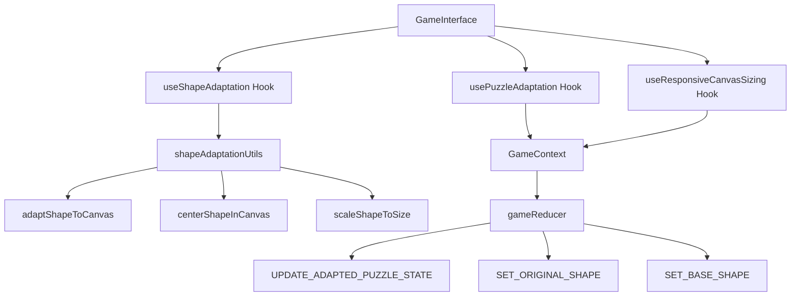
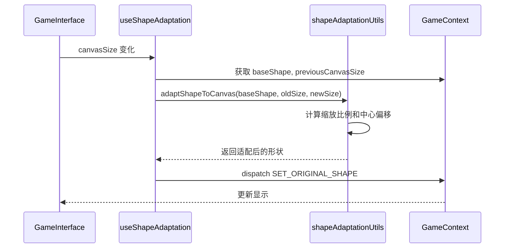

# 目标形状适配优化设计文档

## 概述

本设计文档定义了拼图游戏中目标形状适配优化功能的技术架构和实现方案。该功能能确保在浏览器窗口大小、方向、设备变化时，目标形状能够正确适配并保持视觉一致性，同时修复当前适配机制中的关键问题。

## 系统架构

### 架构图



### 核心组件关系

1. **GameInterface**: 主要游戏界面组件，集成所有适配Hook
2. **useShapeAdaptation**: 专门处理目标形状适配的Hook
3. **usePuzzleAdaptation**: 处理拼图块适配的Hook（已修复）
4. **shapeAdaptationUtils**: 形状适配的核心算法工具库
5. **GameContext**: 全局状态管理，存储形状和画布信息

## 组件和接口设计

### 1. useShapeAdaptation Hook

**职责**: 监听画布尺寸变化，自动适配目标形状

**接口设计**:
```typescript
interface UseShapeAdaptationProps {
  canvasSize: { width: number; height: number } | null;
}

export const useShapeAdaptation = (canvasSize: UseShapeAdaptationProps['canvasSize']) => {
  // ...
  return { adaptShape };
};
```

**核心功能**:
- 监听画布尺寸变化（canvasSize）
- 使用防抖机制避免频繁适配
- 计算缩放比例，保持形状宽高比不变
- 重新计算形状中心位置，确保居中显示
- 适配所有形状点的坐标
- 更新 originalShape 状态

**设计决策**: 
- 使用防抖机制避免频繁适配
- 使用requestAnimationFrame确保平滑渲染
- 缓存适配结果避免重复计算
- 支持多次尺寸变化的幂等适配
- 包含边界情况和错误处理

### 2. shapeAdaptationUtils 工具库

**职责**: 提供形状适配的核心算法

**接口设计**:
```typescript
export interface CanvasSize {
  width: number;
  height: number;
}

// 主要适配函数
export function adaptShapeToCanvas(
  originalShape: Point[], 
  oldSize: CanvasSize, 
  newSize: CanvasSize,
  options?: {
    maxRetries?: number;
    safetyMargin?: number;
    enforceAspectRatio?: boolean;
    debug?: boolean;
  }
): Point[];

// 辅助函数
export function centerShapeInCanvas(shape: Point[], canvasSize: CanvasSize): Point[];
export function scaleShapeToSize(shape: Point[], targetSize: number, canvasSize: CanvasSize): Point[];
export function isShapeInBounds(shape: Point[], canvasSize: CanvasSize, margin?: number): boolean;
```

**设计决策**:
- 使用统一缩放比例（Math.min(scaleX, scaleY)）避免形状变形
- 基于画布中心点进行适配，确保形状始终居中
- 提供完整的错误处理和边界检查
- 支持幂等操作，多次调用结果一致

### 3. GameContext 状态管理

**状态结构扩展**:
```typescript
interface GameState {
  // 现有状态...
  baseShape: Point[];      // 基础形状（未经适配）
  baseCanvasSize: CanvasSize;  // 基础形状对应的画布尺寸
  originalShape: Point[];   // 当前显示的形状（已适配）
  previousCanvasSize: CanvasSize;   // 上一次画布尺寸
  canvasWidth: number;    // 当前画布宽度
  canvasHeight: number;   // 当前画布高度
}
```

**Action 类型**:
```typescript
type GameAction = 
  | { type: "SET_BASE_SHAPE"; payload: { shape: Point[]; canvasSize: CanvasSize } }
  | { type: "SET_ORIGINAL_SHAPE"; payload: Point[] }
  | { type: "UPDATE_ADAPTED_PUZZLE_STATE"; payload: { newPuzzleData: PuzzlePiece[]; newPreviousCanvasSize: CanvasSize } }
  | { type: "UPDATE_CANVAS_SIZE"; payload: CanvasSize }
  // 其他现有 actions...
```

**设计决策**:
- 分离基础形状（baseShape）和当前显示形状（originalShape）
- 记录画布尺寸变化历史，支持适配计算
- 修复 UPDATE_ADAPTED_PUZZLE_STATE 的 payload 字段匹配问题

## 数据模型

### 1. 形状数据流



### 2. 适配算法数据模型

**输入数据**:
- `originalShape: Point[]` - 原始形状点集
- `oldSize: CanvasSize` - 原始画布尺寸
- `newSize: CanvasSize` - 新画布尺寸

**计算过程**:
1. 计算缩放比例: `scale = Math.min(newSize.width / oldSize.width, newSize.height / oldSize.height)`
2. 计算中心偏移: `centerOffset = newCenter - oldCenter`
3. 适配每个点: `newPoint = newCenter + (oldPoint - oldCenter) * scale`

**输出数据**:
- `adaptedShape: Point[]` - 适配后的形状点集

## 错误处理

### 1. 输入验证

**验证规则**:
- 形状点集不能为空
- 画布尺寸必须大于0
- 坐标值必须为有限数值

**错误处理策略**:
```typescript
// 输入验证示例
if (!originalShape || originalShape.length === 0) {
  console.warn('adaptShapeToCanvas: 形状点集为空');
  return originalShape;
}

if (oldSize.width <= 0 || oldSize.height <= 0) {
  console.warn('adaptShapeToCanvas: 画布尺寸必须大于0');
  return originalShape;
}
```

### 2. 计算异常处理

**异常情况**:
- 缩放比例无效（Infinity, NaN）
- 坐标计算结果无效
- 内存不足或计算超时

**处理策略**:
- 使用 try-catch 包装核心计算逻辑
- 验证计算结果的有效性
- 提供兜底方案，返回原始形状

### 3. 状态一致性保证

**问题场景**:
- 多个适配Hook同时运行
- 状态更新时序问题
- 画布尺寸频繁变化

**解决方案**:
- 使用 useEffect 依赖数组控制执行时机
- 添加状态变化检查，避免无效更新
- 实现防抖机制，减少频繁计算

## 测试策略

### 1. 单元测试

**测试覆盖**:
- `adaptShapeToCanvas` 函数的各种输入组合
- 边界情况处理（空数据、极端尺寸）
- 错误处理逻辑

**测试用例示例**:
```typescript
describe('adaptShapeToCanvas', () => {
  it('应该正确缩放形状', () => {
    const originalShape = [{ x: 100, y: 100 }, { x: 200, y: 200 }];
    const oldSize = { width: 400, height: 400 };
    const newSize = { width: 800, height: 800 };
    
    const result = adaptShapeToCanvas(originalShape, oldSize, newSize);
    
    expect(result[0].x).toBe(200); // 中心点不变
    expect(result[0].y).toBe(200);
  });
});
```

### 2. 集成测试

**测试场景**:
- 画布尺寸变化时形状正确适配
- 多次尺寸变化的幂等性
- 不同设备和方向的适配效果

**测试工具**:
- 使用现有测试页面进行可视化验证
- Playwright E2E 测试覆盖多设备场景

### 3. 性能测试

**性能指标**:
- 适配计算时间 < 100ms
- 内存使用稳定，无泄漏
- 频繁尺寸变化时的响应性

**测试方法**:
- 使用 Performance API 测量计算时间
- 监控内存使用情况
- 压力测试连续尺寸变化场景

## 性能优化

### 1. 计算优化

**优化策略**:
- 缓存计算结果，避免重复计算
- 使用 requestAnimationFrame 优化渲染时机
- 实现防抖机制，减少频繁适配

**实现示例**:
```typescript
const useShapeAdaptation = (canvasSize) => {
  const adaptationTimeoutRef = useRef<NodeJS.Timeout>();
  
  useEffect(() => {
    // 防抖处理
    if (adaptationTimeoutRef.current) {
      clearTimeout(adaptationTimeoutRef.current);
    }
    
    adaptationTimeoutRef.current = setTimeout(() => {
      // 执行适配逻辑
      performShapeAdaptation();
    }, 16); // ~60fps
    
    return () => {
      if (adaptationTimeoutRef.current) {
        clearTimeout(adaptationTimeoutRef.current);
      }
    };
  }, [canvasSize]);
};
```

### 2. 内存优化

**优化措施**:
- 避免创建不必要的对象
- 及时清理事件监听器和定时器
- 使用对象池复用计算对象

### 3. 渲染优化

**优化策略**:
- 只在形状实际变化时触发重渲染
- 使用 React.memo 优化组件渲染
- 批量更新状态，减少渲染次数

## 兼容性考虑

### 1. 浏览器兼容性

**支持范围**:
- 现代浏览器（Chrome 80+, Firefox 75+, Safari 13+）
- 移动端浏览器（iOS Safari, Chrome Mobile）
- 微信内置浏览器

**兼容性处理**:
- 使用 Polyfill 处理 API 差异
- 降级处理不支持的特性
- 提供兜底方案

### 2. 设备兼容性

**支持设备**:
- 桌面端（各种分辨率和宽高比）
- 移动端（手机、平板）
- 特殊设备（超宽屏、高分辨率屏幕）

**适配策略**:
- 响应式设计，支持各种屏幕尺寸
- 触摸和鼠标交互兼容
- 高DPI屏幕适配

## 3. 向后兼容

**兼容性保证**:
- 保持现有 API 不变
- 新功能采用渐进增强方式
- 提供配置选项控制新特性

**迁移策略**:
- 保留旧版本兜底逻辑
- 分阶段部署新功能
- 提供平滑的升级路径

## 部署和监控

### 1. 部署策略

**部署步骤**:
1. 修复当前适配机制的关键问题
2. 部署新的形状适配功能
3. 逐步优化性能和用户体验

**风险控制**:
- 功能开关控制新特性启用
- 灰度发布，逐步扩大用户范围
- 快速回滚机制

### 2. 监控指标

**关键指标**:
- 适配成功率
- 适配计算时间
- 用户体验指标（加载时间、交互响应）
- 错误率和异常情况

**监控工具**:
- 性能监控（Performance API）
- 错误监控（Error Boundary）
- 用户行为分析

### 3. 维护计划

**长期规划**:
- 定期维护和性能优化
- 代码重构和兼容性测试
- 用户反馈收集和处理
- 支持更多设备和场景
- 集成新特性开发和优化

## 总结

目标形状适配优化方案通过分离形状生成和适配逻辑，实现了高效、稳定的形状适配机制。该方案解决了当前适配机制中的关键问题，提供了完善的错误处理和性能优化，确保在各种设备和场景下形状都能正确适配并保持视觉一致性。

通过实现防抖机制、缓存计算结果和批量更新状态等优化措施，该方案显著提升了适配过程的性能和用户体验。同时，完善的测试策略和监控机制确保了方案的稳定性和可维护性。